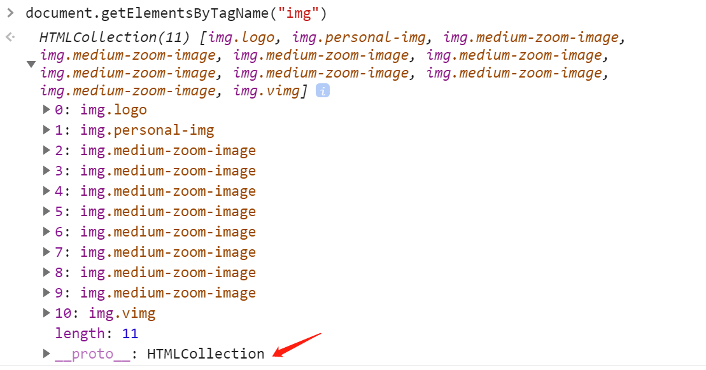
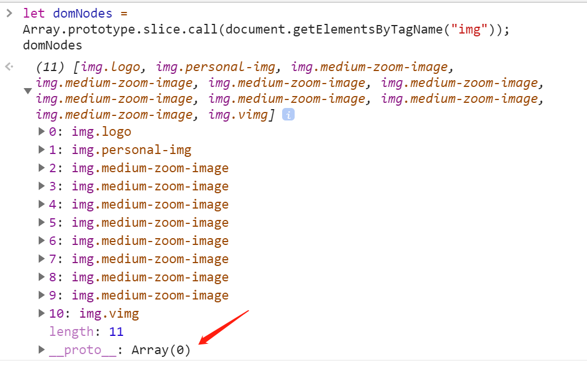

## 基本介绍

### 使用语法

```js
...
// func是一个函数, 在此省略
func.call(thisArg, param1, param2, ...)

func.apply(thisArg, [param1,param2,...]) // 第二个参数是数组

func.bind(thisArg, param1, param2, ...)
```

#### 返回值

* `call` / `apply`: 返回 `func` 执行的结果 ;
* `bind`: 返回 `func` 的拷贝，并拥有指定的 `this` 值和初始参数。

#### 参数

* `thisArg`(可选)
  1. `func` 的 `this` 指向 `thisArg` 对象；
  2. 非严格模式下：若 `thisArg` 指定为 `null`，`undefined` ，则 `func` 的 `this` 指向`window` 对象；
  3. 严格模式下：`func` 的 `this` 为 `undefined`；
  4. 值为原始值(数字，字符串，布尔值)的 `this` 会指向该原始值的自动包装对象，如 `String` 、`Number` 、`Boolean`。

* `param1`，`param2`(可选): 传给 `func` 的参数。
  1. 如果 `param` 不传或为 `null` / `undefined` ，则表示不需要传入任何参数.
  2. apply第二个参数为 [类数组](./Call&Apply&Bind.md#类数组) 对象，数组内各项的值为传给func的参数。

### 必须是函数才可以使用

这三个方法都是 `Function` 的方法, 意味着只有函数对象才能使用;
例如 `Object.prototype.toString` 就是个函数，我们经常看到这样的用法：`Object.prototype.toString.call(data)`。

### 作用

**改变函数的 `this` 指向** , 目前这三个方法都是拿来做这件事的
从[返回值](./Call&Apply&Bind.md#返回值)可以看出它们的作用区别:

* `call` / `apply`: 修改 `this` 后再 **执行** 该函数
* `bind`: 修改 `this` 后 **不执行** , 而是返回该函数

### 分清 call 和 apply

这两个方法最终实现的效果是完全相同的, 唯一的不同点是在参数的写法上:

* `apply` 只有两个参数, 第二个参数为数组, 其中包含了所有参数
* `call` 有n个参数, 其中第2~n个包含了所有参数

::: tip 记忆方法
**apply an array**: 他们都以相同的字母 `a` 开头, 这里的array 是指 [类数组](./Call&Apply&Bind.md#类数组)
:::

### 类数组

数组的特征有：可以通过索引(`index`) 调用，如 `array[0]`；具有长度属性 `length`；可以通过 `for` 循环或 `forEach` 方法，进行遍历。

那么，类数组是什么呢？顾名思义，就是具备与数组特征类似的对象。比如，下面的这个对象，就是一个类数组。

```js
let arrayLike = {
  0: 1,
  1: 2,
  2: 3,
  length: 3
};
```

类数组，还是比较常用的，只是我们平时可能没注意到。比如，我们获取 DOM 节点的方法，返回的就是一个类数组(下一节将有例子来说明)；再比如，在一个函数体中使用 `arguments` 获取到的所有参数，也是一个类数组。

但是需要注意的是：**类数组无法使用 `forEach()`、`splice()`、`push()` 等数组原型链上的方法**，毕竟它不是真正的数组。那么类数组想使用数组原型链上的方法，该怎么办呢？请继续往下看。

## 核心理念: 借用方法

刚刚在 [作用](./Call&Apply&Bind.md#作用) 这一节提到了它们都是在修改 `this` 的指向, 这只是表面效果, 真实的意思其实是: **借用方法**。

**借助已实现的方法，改变方法中的 `this` 指向，减少重复代码，节省内存。**

现在来试试上一节提到的获取DOM是类数组的例子:

```js
document.getElementsByTagName("img")
```



在控制台可以看到, 获取的结果是HTMLCollection 是有length信息的类数组, 而非真正的数组Array。

现在如果我们想对获取出来的内容进行遍历, 通常的做法就是用 `for`, 但我们要执意想让 __类数组__ 也能使用 `forEach` 方法怎么办呢?

这时候我们就来借一下数组的方法, 并让数据由 __类数组__ 变成 __真正的数组__:

```js
let domNodes = Array.prototype.slice.call(document.getElementsByTagName("img"))
```



这里利用了 `slice()` 方法的返回值特点, 由于没有第二个参数, 这里并未执行删除操作, 所以返回了被操作的数组本身, 当然最开始它只是类数组, 由于 `this` 的指向改变, 类数组充当了 `slice()` 的参数, 最终被作为数组返回出来。

## 更多应用场景

上一节其实就一个真实的使用场景了, 除此之外, 下面介绍的这些使用场景，摸透其中的门道之后，就会发现本质上还是：**借用方法**

### 最基础的借用

```js
var obj1 = {
  a() {
    console.log(this.toString() + 'obj1')
  }
}

function func2() {}
func2.a = function () {
  console.log(this.toString() + 'func2')
}

console.log(func2.a()) // >> function func2() {}fun2

// 执行上下文发生变化
console.log(func2.a.call(obj1)) // >> [object Object]func2
```

### 类型判断

经典的借用看这里: [数据类型的判断](./../summary/OriginalJavaScript.md#对象)

### 数组找最大最小值

借助Math对象, 可以在多个数字中找最大值,他们以可枚举的状态入参, 当源数据是数组时, 可以用 `apply()` 来借一下Math的 `max()` 方法, 注意这里可以使用 `apply()` 是因为 `apply()` 接收的第二个参数正好是数组, 并且实际应用是还会对其结构成枚举属性, 正好符合 `max()` 方法需要的参数结构

```js
const array = [45, 12, 55, 68, 78]

Math.max.call(Math, array) // >> 78
Math.min.call(Math, array) // >> 12
```

### 找回执行上下文Context

先看如下代码:

```js
var module = {
  x: "xxx",
  getX: function() {
    return this.x;
  }
}

console.log(module.getX()); // >> xxx

var getXOuter = module.getX
console.log(getXOuter()) // >> undefined
```

让`getXOuter()` 也能正常输出 `xxx`, 肥肠简单:

```js
var getXOuter = module.getX
console.log(getXOuter.call(module)) // >> xxx
```

本例展示了在不同的执行上下文中this的指向是**不同**的, 前者的上下文是module, 后者是window; 所以不要主观的依据this存在的位置来判断其实际的指向

具体的关于执行上下文、作用域、this相关内容可以在这里查看这篇: [执行上下文、作用域、this](./This&Context&Scope.md)
