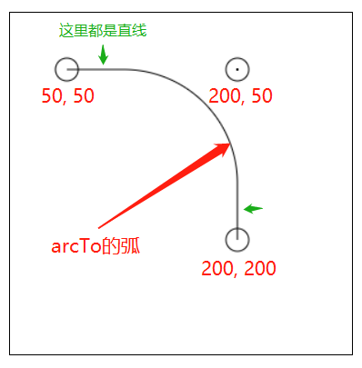
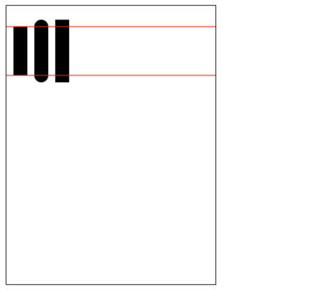

## 前言

传统的HTML是非常结构化的文档, 同时它可以结合CSS来创造出非同凡响的多样化文档, 并一直演化改变我们现在的网页表现形式, 但是, 人无完人, 面对一些更加复杂且更加脱离文档流的内容时, 例如图表绘制, 复杂多边形的展示等, 只用HTML和CSS就显得非常吃力, 于是专门用来画图的 __canvas__ 诞生了

canvas从HTML5开始引入, 它本质仍然是文档中的一个元素, 但是他支持一些特殊的API, 让你能通过JavaScript代码来绘制一些复杂的图形

浏览器|兼容性
:-|:-
Firefox| 1.5+
IE|9+
Chrome|
Opera|

本文以小白的角度出发, 从零开始, 从canvas的使用、API和一些实例等角度进行介绍, 看完掌握canvans的基本应用( ~~应该是吧~~ )

## 起步

### 创建画布

canvas的根基是 `<canvas><canvas/>` 标签元素, 所以可以直接放入你的文档流中, 但是需要注意, 因为它是一个**画布**, 所以是内置宽度 `width` 和高度 `height` 信息的, 如果你不给它指定任何宽高信息, 那么将应用默认值:

```html
<canvas id="canvas" width="300" height="150"></canvas>
```

虽然现代浏览器都广泛支持了canvas, 但是仍然有不支持它的~~高级~~浏览器, 所以这里可以使用替换值来应对不支持的情况:

```html
<canvas id="canvas" width="300" height="150">
  这里是替换内容文本, 在不支持canvas的浏览器中才显示
  <!-- 也可以是图片, 但要注意宽高与canvas保持一致
    
  -->
</canvas>
```

这里的画布创建好了, 画布的定义对于任何前端开发人员都不陌生, 它就是 **在给定像素区域内的坐标系**, 坐标原点在`(0, 0)`处, 水平向右为x轴正向, 垂直向下为y轴正向, 这一点与CSS是一样的; 当然这个坐标点是可以变化的, 并且画布也可以旋转, 这部分后面再来说

### 创建画笔

创建完画布元素, 接下来就是开始画画了, 画笔有自己的名字: **渲染上下文(`The Rending Context`)**, 一个canvas被创建后会公开一个或多个画笔, 本文只介绍2D画笔, 前文中提到了canvas是用JavaScript来操作绘制的, 那么现在开始获取:

```js
const canvas = document.getElementById('canvas');

const pen = canvas.getContext('2d'); // 2d画笔
```

与HTML中一样, 画图前也需要检测兼容:

```js
if(!canvas.getContext) return;

const pen = canvas.getContext("2d");
// codes goes here
```

::: tip 为什么叫上下文?
用canvas画图时, 执行语句逻辑跟JavaScript是一样的, 逐行执行, 在后面的内容学习中慢慢体会这个 上下文 的含义
:::

#### 路径

路径(`path`)是图形的基本构成元素, 路径即可以理解为笔画过的痕迹, 路径并不一定都是显式的

**路径在不进行描边填充时是透明的**, 如果你知道ps, 里面有一个钢笔工具, 钢笔工具所绘制的就是路径, 并且没有任何图像信息, 当执行描边或者填充时才具有图像信息, 事实上如果你具有PS的使用经验, 后面的内容会更好理解

在canvas中, 渲染上下文是这样描绘一个完整的路径:

1. 路径开始, 创建起始绘制点
2. 路径描绘命令, 即进行点和线的移动等命令
3. 关闭路径, 如果路径未被关闭, 那么后续的绘制命令将会继续使用这个未关闭的路径
4. 绘制结束, 如果还需要绘制别的新路径, 重复第一步直至全部绘制完成

```js
(function draw(){
  const canvas = document.getElementById('canvas');
  if(!canvas.getContext) return;
  const pen = canvas.getContext("2d");
  pen.beginPath(); // 开创路径

  // ...执行任意一个或多个绘图命令

  pen.closePath(); // 直至最后结束
})()
```

掌握了基本步骤之后, 就开始画图吧, 首先先过一下这些常用的方法

## 绘制方法

本节介绍各种绘图的方法, 并在节尾详细总结各种方法的使用和描述, 本节的代码片段都默认去掉了初始化canvas的代码(`pen`对象即是渲染上下文), 全部例子中直接是绘制命令

::: warning 警告
任意路径在未被关闭前继续执行绘制命令时, 下一次执行命令都会沿用上一次的绘制点, 尤其是`fill()`这种命令的的情况一定要注意!
:::

### 直线

canvas中画直线使用`lineTo()`方法, 就跟现实里画图一样, 连接两点即可

```js
// 画一条坐标从(50, 50) 到 (100, 100)的直线
pen.beginPath();
pen.moveTo(50, 50);
pen.lineTo(100, 100);
pen.stroke();
pen.closePath();
```

### 矩形

canvas唯一内置的图形画笔, 它能简便地直接画出矩形, 而不是通过创建路径(path)后封闭再涂色

矩形绘制有三种内置方法:

方法名称|描述|参数|样例
:-|:-|:-|:-
fillRect|绘制并填充矩形|(x, y, width, height)|pen.fillRect(10, 10, 55, 50);
strokeRect|绘制矩形边框|(x, y, width, height)|pen.strokeRect(10, 10, 55, 50);
clearRect|清除矩形区域内的内容|(x, y, width, height)|pen.clearRect(10, 10, 55, 50);

```js
pen.fillStyle = "rgb(200,0,0)";
// 绘制矩形
pen.fillRect (10, 10, 55, 50);

// 从这里能理解渲染上下文的意义
pen.fillStyle = "rgba(0, 0, 200, 0.5)";
pen.fillRect (30, 30, 55, 50);
```

### 弧

canvas内有多种方法画出弧线, 有纯圆弧的`arc`, 圆角`arcTo`, 贝塞尔曲线`quadraticCurveTo`

#### 圆弧 arc

`arc()`方法可以画弧也可以画圆, 它画的弧是标准的圆弧, 所以它无法画出椭圆或者椭圆的圆弧

`arc(x, y, r, startAngle, endAngle, anticlockwise)`: 以 `(x, y)` 点为圆心以 `r` 为半径绘制一条弧, `startAngle` 和 `endAngle` 控制绘制的弧线范围; `anticlockwise` 是否为逆时针, 该值为布尔型, 默认为`false`, 即默认顺时针

::: warning 注意

* `startAngle` 和 `endAngle` 为角度, 而非直接的度数单位(0° - 360°), 用`Math.PI`指代180°
* 弧度为0时, 指x轴正向
:::

```js
pen.arc(50, 50, 40, 0, Math.PI / 2);
```

::: warning 注意
使用arc()方法画弧时, 需要注意上下文绘制的起始点并非是在`(x, y)`处, 而是在实际画弧的起始点位置处, 所以使用`ink`类的方法时, 注意不要产生多余的连线
:::

#### 圆角线 arcTo

arcTo()会有点抽象, 结合代码按下图来理解:

```js
pen.beginPath();
pen.moveTo(50, 50);
pen.arcTo(200, 50, 200, 200, 50); // 绘制弧线
pen.closePath();


// 辅助内容
// 绘制点(x, y)画圆
pen.beginPath();
pen.arc(50, 50, 10, 0, Math.PI * 2);
pen.stroke();

// (x1, y1) 画点
pen.beginPath();
pen.fillStyle = "#000";
pen.fillRect(199, 49, 2, 2); // 用矩形来画点

// (x1, y1) 画圆
pen.beginPath();
pen.arc(200, 50, 10, 0, Math.PI * 2)
pen.stroke();

// (x2, y2) 画圆
pen.beginPath();
pen.arc(200, 200, 10, 0, Math.PI * 2)
pen.stroke();
```



可以理解为从绘制点开始, 经由(x1, y1)转折, 最后到达(x2, y2), 圆弧线即是在转折点(x1, y1)处向折角内产生

::: warning fill()
仅调用fill()时, 虽然会自动将首尾点位连接并进行填充, 看起来像是路径闭合了, 但是注意: **当前的路径仍然没有闭合**, 下一次执行绘制命令时将继续延伸本路径!
:::

### 贝塞尔曲线 quadraticCurveTo

贝塞尔曲线(Bézier curve)，又称贝兹曲线或贝济埃曲线，是应用于二维图形应用程序的数学曲线。

一般的矢量图形软件通过它来精确画出曲线，贝兹曲线由线段与节点组成，节点是可拖动的支点，线段像可伸缩的皮筋，我们在绘图工具上看到的钢笔工具就是来做这种矢量曲线的。

::: tips 知识点扩展
贝塞尔曲线是计算机图形学中相当重要的参数曲线，在一些比较成熟的位图软件中也有贝塞尔曲线工具如 PhotoShop 等。在 Flash4 中还没有完整的曲线工具，而在 Flash5 里面已经提供出贝塞尔曲线工具。

贝塞尔曲线于 1962，由法国工程师皮埃尔·贝塞尔（Pierre Bézier）所广泛发表，他运用贝塞尔曲线来为汽车的主体进行设计。贝塞尔曲线最初由Paul de Casteljau 于 1959 年运用 de Casteljau 演算法开发，以稳定数值的方法求出贝兹曲线。
:::

我们开始画一条贝塞尔曲线(二次)吧!

```js
pen.beginPath();
pen.moveTo(50, 50); // 贝塞尔曲线起始点

var cp1x = 40, cp1y = 100;  //贝塞尔曲线控制点
var x = 200, y = 200; // 贝塞尔曲线结束点

pen.quadraticCurveTo(cp1x, cp1y, x, y); // 用点信息绘制贝塞尔曲线
pen.stroke();
```

发现了吗, 这个参数形式跟绘制`artTo()` 非常相似, 你可以按照跟其一样的方式理解这三个点的具体作用

除了二次以外, 还有三次贝塞尔曲线, 它比二次贝塞尔曲线多了一个控制点, 它是这样使用的

```js
pen.bezierCurveTo(cp1x, cp1y, cp2x, cp2y, x, y)
```

### 方法小结

方法名称|描述|参数
:-|:-|:-
beginPath|创建一个新的路径, 将自动闭合前一个路径|-
closePath|闭合路径, 绘制点位会停留在上一次绘制的终点|-
moveTo|移动绘制点到`(x, y)`|(x, y)
lineTo|移动绘制点到`(x, y)`, 并画一条**绘制点**到`(x, y)`之间的直线描线|(x, y)
arc|以`(x, y)`为圆心, 以`r`为半径, 从`startAngle`到`endAngle`的角度画圆弧, 其中 `anticlockwise`表示方向, `true`: 逆时针, `false`: 顺时针(default值)|(x, y, r, startAngle, endAngle, anticlockwise)
arcTo|从 **绘制点** 开始, 依次连接到`(x1, y1)`, `(x2, y2)`, 最后根据`radius`的弧度将这两点三个点产生的折角变为弧|arcTo(x1, y1, x2, y2, radius)
quadraticCurveTo|从 **绘制点** 开始, 经由单个 **控制点**`(cp1x, cp1y)`控制曲率, 最后到达终点`(x, y)`|quadraticCurveTo(cp1x, cp1y, x, y)
bezierCurveTo|从 **绘制点** 开始, 经由两个 **控制点**`(cp1x, cp1y)` 、 `(cp2x, cp2y)`控制曲率, 最后到达终点`(x, y)`|bezierCurveTo(cp1x, cp1y, cp2x, cp2y, x, y)
stroke|描边路径, 使路径显示|-
fill|填充路径, 使路径显示|-

## 添加样式

经过上一节, 我们已经可以在画布中画出一些基本的图形和线条了, 然后我们开始学习更多的样式吧

### 颜色

想要给绘制的图形上色, 需要指定 `fillStyle` 或者 `strokeStyle`, 注意使用这两个属性时会影响上下文pen, 它会一直继承上一次设置的颜色值, 直到绘制结束或者重置颜色

`pen.fillStyle = color` 指定填充颜色
`pen.strokeStyle = color` 指定描边颜色

颜色值可以是 色码: `'#ececece'`、颜色名称: `'red'`、rgb色彩: `'rgb(255, 0, 255)'`

### 线条样式

#### 线宽度 lineWidth

在绘制路径中, path可以理解为无宽度的线条, 在stroke之后才拥有了1像素的宽度, 要想让这个宽度变宽, 就要用到 `lineWidth` 这个属性, 他接受一个number类型的宽度

注意指定线宽度后, 线条的中心是path的路径, 即在线条左右两侧各占lineWidth值的一半宽度

#### 线条末端与折点 lineCap & lineJoin

线条有始有终, 同样也有拐点, 这些细节的地方也有对应的属性进行定义, 首先是 `lineCap`

```js
pen.lineCap = 'butt'; // 最通常的类型, 以一个矩形结束
pen.lineCap = 'round'; // 圆角末端, 一亿个半径为lineWidth的圆结束
pen.lineCap = 'busquarett'; // 以额外的矩形结束, 额外的矩形拥有linewidth一半的长度
```



接着是线条折点

```js
pen.lineJoin = 'miter'; // 默认状态, 
pen.lineJoin = 'round'; // 最通常的类型, 以一个矩形结束
pen.lineJoin = 'bevel'; // 圆角末端, 一亿个半径为lineWidth的圆结束
```
