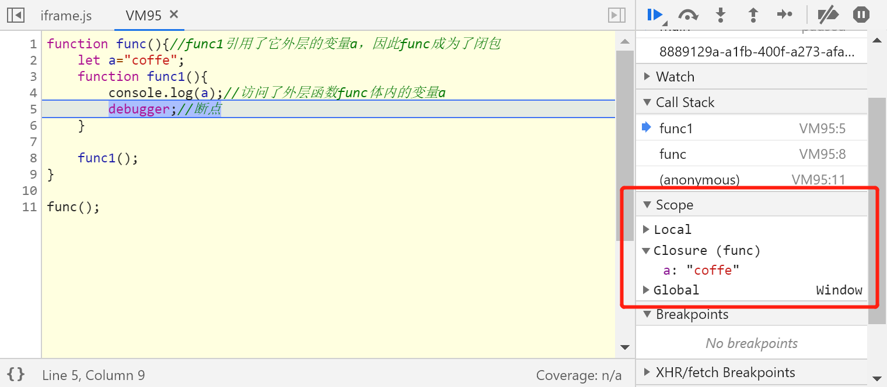

传说中面试必考内容?

<!-- more -->

## 前言
还是以一个小例子作为引子:

```js {3}
for (var i = 1; i <= 5; i++) {
   setTimeout(function test() {
        console.log(i) // 连续输出五次6
    }, i * 1000);
}
```

其实本意是想依次输出 `1 2 3 4 5`, 结果变成了在最后连续输出了 `6 6 6 6 6`, 这是因为 `test` 函数内的变量 `i` 没有找到在 **当前作用域** 内的已有变量, 于是去寻找 **作用域链** 上的可用变量, 最终找到了 `for` 循环的变量 `i`, 同时由于 `setTimeout` 的延迟机制, 在执行其内部的代码时, `i` 的值早已变为了 `6`。

那么, 要实现我们的本意, 我们对上面的代码利用 **闭包** 进行改造:

```js {2-4,6}
for (var i = 1; i <= 5; i++) {
  (function(j) {//包了一层IIFE形式的函数，这个函数是闭包
    setTimeout(function test() {//函数体内的j引用了外层匿名函数的参数j
      console.log(j); //>> 1 2 3 4 5
    }, j * 1000);
  })(i); // IIFE ends
}
```

再回顾下以上代码发生了什么:

* 匿名IIFE函数暴露了一个参数 `j`, 这个参数的实际只想就是 `for` 循环中 `i`的值, 由于多了一层函数, `setTimeout` 中的 `j` 其实是引用到了他上层匿名IIFE函数的变量 `j`, 这个值就是每次 `for` 循环遍历中的值。

* 每次循环遍历时, `test` 每次都正确的访问到了 `for` 循环中的 `i`, 然后满足了我们的需求, nice~

::: tip 要点
* 闭包一定是 **函数**
* 多嵌套的一层函数, 强制性的修改了 **作用域**
:::

## 什么是闭包?
通过上面改写后的例子, 我们来说说到底啥是闭包:

::: tip 太长不看版:
__内层的作用域__ 访问它 __外层函数作用域__ 里的 __参数/变量/函数__ 时，闭包就产生了。
:::

先解释一下上面那句话是在说啥, 在浏览器中运行下面的代码并查看控制台:

```js
function func(){//func1引用了它外层的变量a，因此func成为了闭包
    let a = "coffe";
    function func1(){
        console.log(a);//访问了外层函数func体内的变量a
        debugger;//断点
    }

    func1();
}

func();
```



在控制台可以看到闭包其实是一个作用域, 既然是作用域, 那我们将最开始的例子用 `let` 和 **作用域** 进行修改一下:

```js {4}
for (var i = 1; i <= 5; i++) {
  {
    let j = i;
    setTimeout(function test() {
      console.log(j) //>> 1 2 3 4 5
    }, j * 1000);
  }
}
```

果然，用 `let` 关键字再包裹一个作用域，也能和闭包一样解决问题达成目的。因此可以说:

**闭包是一种作用域，它拷贝了一套外层函数作用域中被访问的参数、变量/函数，这个拷贝都是 _浅拷贝_**。

## 闭包能带来什么?
以上一节的 `func()` 为例, 其中变量 `a` 类似于高级语言的私有属性，无法被 `func()` 外部作用域访问和修改，只有 `func()` 内部的作用域（含嵌套作用域）可以访问。这样可以实现软件设计上的封装，设计出很强大的类库、框架，比如我们常用的Vue.js、jQuery、AngularJS。

这里有一个 ES6出现之前 最常见的模块化封装的例子:

```js
//定义一个模块
function module(n) {
  //私有属性
  let name = n;
  //私有方法
  function getModuleName() {
    return name;
  }
  //私有方法
  function someMethod() {
    console.log("coffe1891");
  }
  //以一个对象的形式返回
  return {
    getModuleName: getModuleName,
    getXXX: someMethod
  };
}

let myapp = module("myModule");// 定义一个模块
console.log(myapp.getModuleName()); // >> myModule
console.log(myapp.getXXX()); // >> coffe1891
```

## 闭包是完美的吗?
::: tip JavaScript的垃圾回收 (GC)
如果对象不再被引用，或者对象互相引用形成数据孤岛后且没有被孤岛之外的其他对象引用，那么这些对象将会被JS引擎的垃圾回收器回收；
反之，这些对象一直会保存在内存中。
:::

回到问题上来, 由于闭包会在内层函数中引用(浅拷贝)外层函数作用域内的变量或者functions, 当外层的函数执行完并退出调用栈(call stack) 时, 由于闭包导致其一直处于被引用的状态以至于无法被回收, 因此会比非闭包函数占用的内存更多, 来看一个小例子:

```js
function failCount() {
  let count = 0;
  count ++;
  console.log(`失败的: ${count}`);
  return count;
}

function countFunc() {
  let count = 0;
  function startCount(){
      count ++;
      console.log(`成功的: ${count}`);
  }
  return startCount;//函数 startCount 保持了对count的引用
}

let times = countFunc();
times(); // >> 成功的: 1
times(); // >> 成功的: 2
times(); // >> 成功的: 3

failCount(); // >> 失败的: 1
failCount(); // >> 失败的: 1
failCount(); // >> 失败的: 1
```

这里 `times` 内能一直累加就是因为 `countFunc()` 函数没有被回收, 其作用域内的变量 `count` 由于被 `startCount()` 引用而导致一直未被回收, 所以多次调用可以实现累加的效果, 再看看 `failCount()` 函数由于没有被任何内容引用, `count` 在每次执行完都会被回收, 所以无法实现累加的效果。

避免闭包导致内存泄漏的解决方法是，在函数 `countFunc()` 执行完毕退出函数调用栈之前，将不再使用的局部变量全部 **删除** 或者赋值为 `null`。

## 闭包的拓展使用
除了上述的循环中的闭包和模块化封装, 闭包还有一些别的写法与用途

### 返回一个新的函数
```js
function sayHello(name) {
  let text = `Hello ${name}`

  return function sayItOut() {
    console.log(text)
  }
}

const greeting = sayHello('ZooMze')
greeting()// >> 'Hello ZooMze'
```

`sayHello()` 函数返回了 `sayItOut()`, 并作为 `greeting` 的值, `greeting` 实际是一个引用变量, 指向函数 `sayItOut()` 本身。

### 扩展全局对象的方法
```js
var num = 666 // 不会变化

function setupSomeGlobals() {
  // 私有变量
  var num = 666;

  gAlertNumber = function() { // 没有用var和let关键字声明，会成为全局对象(window)的方法
    console.log(num);
  };

  gIncreaseNumber = function() {
    num++;
  };

  gSetNumber = function(x) {
    num = x;
  };
}

setupSomeGlobals(); // 执行后闭包产生
gAlertNumber(); // >> 666

gIncreaseNumber();
gAlertNumber(); // >> 667

gSetNumber(1891);
gAlertNumber(); // >> 1891
```

`gAlertNumber()`, `gIncreaseNumber()`, `gSetNumber()` 三个全局函数都是在 `setupSomeGlobals()` 中声明的, 他们指向的闭包和 `setupSomeGlobals()` 的作用域相关联, 所以这三个函数操作的变量正是`setupSomeGlobals()` 的内部变量 `num`, 而非全局变量 `num`。
::: tip 声明变量有无关键字的区别
* 带var的变量是 声明一个全局变量，不能被delete删除
* 不带var的变量是 创建一个全局对象（window）的属性，可以用delete关键字删除
:::

### 延长局部变量的生命
日常开发时，Image对象经常被用于数据统计的上报，示例代码如下：

```js
var report = function(src) {
  var img = new Image();
  img.src = src; // resolve Cross-orgin Request
}

report('http://www.xxx.com/getClientInfo'); // 把客户端信息上报数据
```

这段代码在运行时，发现在一些低版本浏览器上存在bug，会丢失部分数据上报。原因是 `Image` 对象是 `report()`函数中的局部变量，当 `report()` 函数调用结束后，`Image` 对象随即被JS引擎垃圾回收器回收，而此时可能还没来得及发出http请求，所以可能导致此次上报数据的请求失败。
怎么办呢？我们可以使用闭包把Image对象封闭起来，就可以解决数据丢失的问题，代码如下：

```js
var report = (function() {
  var imgs = [];//在内存里持久化
  return function(src) {
    var img = new Image();
    imgs.push(img);//引用局部变量imgs
    img.src = src;
  }
}());

report('http://www.xxx.com/getClientInfo');//把客户端信息上报数据
```