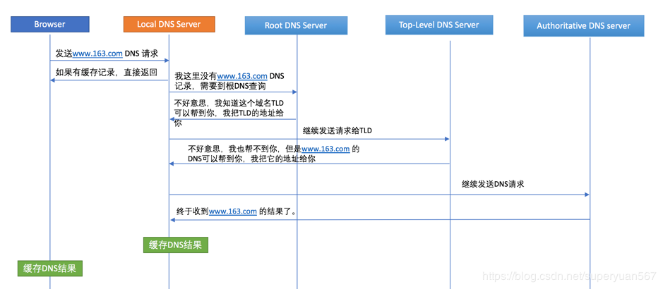
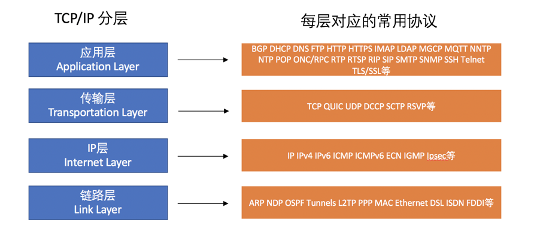
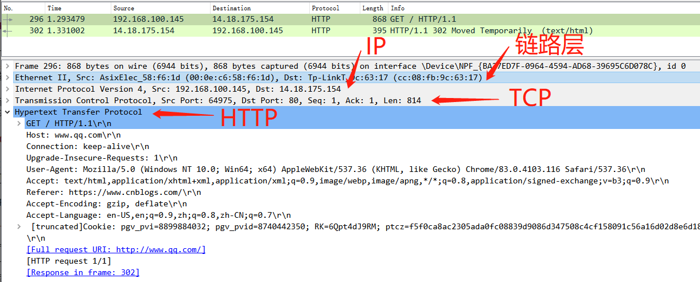
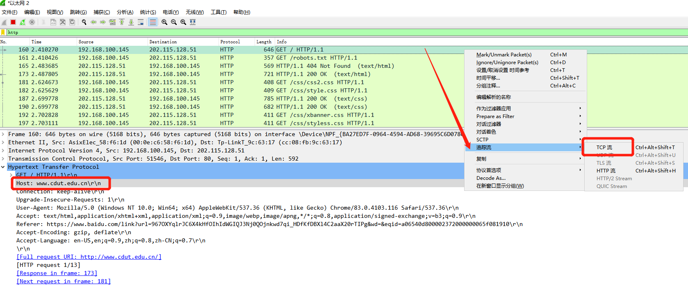
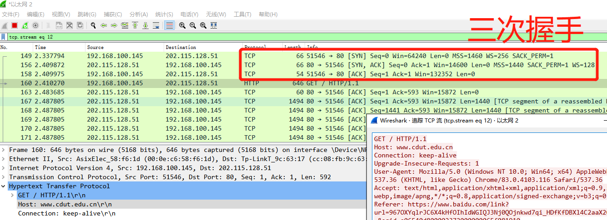
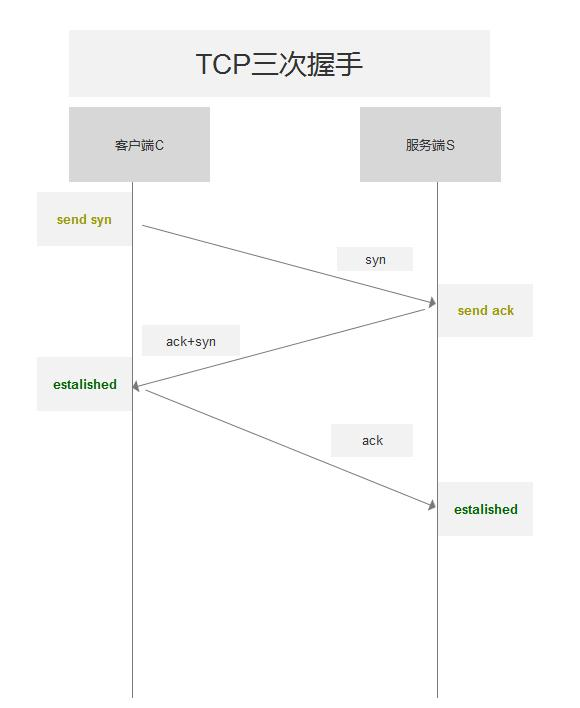

这个看似简单的过程, 其实藏着非常多的基础知识点
<!-- more -->

首先总结下大致的流程有哪些然后进行展开阐述:

1. DNS查询
2. 建立TCP连接
3. 发送HTTP请求
4. 服务器处理请求并返回报文
5. 浏览器解析并render页面
6. 完成后连接断开

## DNS 查询

巩固一下 DNS的定义, 全称是Domain Name System, 指域名系统, 主要用于域名和IP地址的转换

如果你输入的是纯IP, 则不会进行DNS查询, 所以输入域名的情况才会进行DNS查询, 域名只是为了方便记忆, 本节内容的前提是输入的URL是域名:

::: tip 域名的定义
由一串用点分隔的名字组成的Internet上某一台计算机或计算机组的名称，用于在数据传输时标识计算机的电子方位（有时也指地理位置）
:::

这里是解说:

1. 首先浏览器查找**本地DNS**(Local DNS Server) 缓存的记录, 如果有就直接返回IP
2. 如果上一步没有找到, 则往上到**根DNS**(Root DNS Server), 根DNS会判断去找哪个顶级服务器
3. **顶级DNS**, 即TLD(Top-Level DNS Server), TLD 会去找正确的授权服务器
4. 在**授权DNS**(Authoritative DNS Server) 内即可获取到正确的DNS结果, 并返回正确的IP

详细可以在这里了解, [How DNS works](https://www.verisign.com/en_US/website-presence/online/how-dns-works/index.xhtml), 英文水平差点估计看着吃力

## TCP 连接

经过上一步的DNS查询后, 接下来就要开始将获取到的IP(Internet Protocol)拿来建立TCP连接了, TCP(Transmission Control Protocol) 是一种面向连接的、可靠的、基于字节流的传输层通信协议。

\* 本节使用 [WireShark](https://www.wireshark.org/download.html) 抓包工具进行演示辅助理解

#### TCP/IP 模型

关于TCP/IP协议, 也可以 [点这里](https://blog.csdn.net/oro99/article/details/51198018) 查看

TCP/IP 模型分为四层: 应用层, 传输层, IP层, 链路层。

懵逼树下懵逼果, 懵逼树前你和我, 下面就开始用刚刚提到的抓包工具来访问一下鹅网 [www.qq.com](https://www.qq.com/), 在wireshark里面查看每一个层都是啥样的

### TCP 的三次握手

三次握手(Three-way Handshake), 是指 **建立一个TCP连接时, 客户端和服务器总共要发送三个包**。

这里访问一哈 [成都理工大学官网](http://www.cdut.edu.cn/), 在wireshark找到如图所示的这一条, 并追踪其TCP流:

1. 第一次握手: 客户端发送 SYN = 1, seq = x
2. 第二次握手: 服务器发送 SYN = 1, seq = y, ACK = 1, ack = x + 1
3. 第三次握手: 客户端发送 seq = x + 1, ACK = 1, ack = y + 1

简略版图示:

这里我有看到一个神奇的比喻:

在一个漆黑的夜晚对面有个妹子走来, 由于环境影响不能完全确认是不是熟人, 这时候就需要招手来互相确认是不是认识:

你首先向妹子招手(send SYN)，妹子看到你向自己招手后，向你点了点头挤出了一个微笑(send ack)。你看到妹子微笑后确认了妹子成功辨认出了自己(进入estalished 确认状态);。

妹子有点不好意思, 出于礼貌点了点头露出了微笑(send ack), 但是她也不完全确定你是在跟她打招呼, 万一是别人呢, 于是她也向你确认: 招手和微笑(send SYN), 这时候你发现她也在招手跟你确认, 于是你再次以点头和微笑回应(send ack), 这样你们就快速走到跟前相认啦!

回顾一下这个过程:

1. 你招手
2. 妹子点头微笑
3. 妹子招手
4. 你点头微笑

其中妹子 点头微笑 和 招手 是可以同时进行的, 于是简化一下, 就成了标准的 '三次握手'

1. 你招手
2. 妹子点头微笑并招手
3. 你点头微笑

## HTTP 请求

握完手之后, TCP连接就建立好了, 接下来就是常用到的请求内容了, 浏览器的开发者工具就能捕获到这些内容, 例如 GET 请求等

### HTTPS

HTTPS 中的 'S' 指 **SSL/TLS** 的鉴权/认证

这部分内容去看看阮老师的就好, 这儿就不班门弄斧了...

[SSL/TLS协议运行机制的概述](http://www.ruanyifeng.com/blog/2014/02/ssl_tls.html)
[图解SSL/TLS协议](http://www.ruanyifeng.com/blog/2014/09/illustration-ssl.html)

## HTTP 响应

服务器处理上述的请求完毕后, 开始执行响应动作, 返回所请求的内容或是JSON数据一类的都是在这个阶段内

## 浏览器解析 & 页面渲染

拿到了服务器返回的东西之后呢, 然后就是把这些东西呈现给用户了

根据服务器返回的东西类型不同, 浏览器对应的解析也是有不同的, 这里以返回 HTML 页面为例进行说明(不考虑返回JSON或者XML)

### 渲染树 Render Tree

浏览器渲染的过程其实是渲染 DOM 树和 CSSOM 树的融合, 两者的组合构成了浏览器的渲染树 Render Tree, 浏览器根据这些信息决定渲染谁和渲染再网页的哪个位置上, 例如 `display: none` 属性就会影响到对应节点的渲染。

1. 处理 HTML 标记并构建 DOM 树。
2. 处理 CSS 标记并构建 CSSOM 树。
3. 将 DOM 与 CSSOM 合并成一个渲染树。
4. 根据渲染树来布局，以计算每个节点的几何信息。
5. 将各个节点绘制到屏幕上。

渲染完成后，连接即断开；

至此，就完成了从输入URL 到渲染完成页面的全部过程

## Web 优化

Web优化
我们知道，人的耐心是有限的，一个页面如果超过8s，人基本上不会等了，这会对业务产生巨大影响。我们该如何去优化页面呢？

思路很简单，就是按照我们前面介绍的几大步骤去优化。我们先回顾一下几大步骤：

1. DNS查询
2. TCP连接
3. 发送HTTP请求
4. Server处理HTTP请求并返回HTTP报文
5. 浏览器解析并render页面
6. HTTP连接断开

以下简单的说明了一些可优化的点：

1. 尽量将server离用户近一些，例如人处在中国访问Apple，应该是Apple中国站提供服务，GSLB很重要。
2. 不要把layout嵌入一层又一层，简单说就是嵌套别太深，不然影响解析和渲染性能。
3. 有些数据可以在后台处理的，就不要在前端通过JavaScript处理了。
4. 如果请求过大，Load Balance这些手段还是要上的。
5. 保持HTTP连接，合理设置Connection。
6. 后台事件性能要高，能够及时将结果返回给用户。
