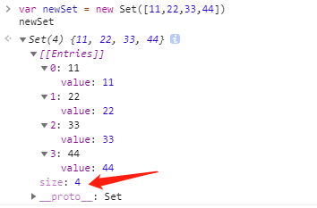

## 前言

JS 中默认对象的表示方式是 `{}`, 即键值对的形式存在

Set & Map 是 ES6 提出的新的数据结构, 它扩展了这种传统的表示形式

概括一下:

* **Set是 `index`-`value` 映射**
* **Map是 `value`-`value` 映射**
* **它们都是 `Object`**

## Set

* **Set 本身是一个构造函数，用来生成 Set集合**
  
Set集合 类似于数组 `Array`，但其本身并不是数组 `Array`, 实际上是按顺序地储存了 **值`Value`的集合** 的对象(Object); 其成员(也就是值`value`) 都是唯一的，没有重复成员。

利用其不允许重复的特性, 通常用于简单的数据去重。

```js
let s1 = new Set(); // 空Set
let s2 = new Set([1, 2, 3]); // 1, 2, 3
let s2 = new Set([1, 2, 3, 3]); // 1, 2, 3(重复的value将会自动过滤)
```

Set 有如下方法和属性:

| 属性/方法名称 | 描述 |
|:-|:-|
|`add(value)`|向Set中添加成员值|
|`has(value)`|判断值`value`是否存在Set对象中, 返回布尔值|
|`delete(value)`|删除某个成员，删除成功返回`true`, 否则返回`false`|
|`clear()`|清除所有成员，没有返回值|

::: danger 警告
Set集合可以是多维数据, 多维数据时无法直接使用 `has()` 方法判断对象
:::

### Set的遍历

由于不是数组, 并不能直接通过下标进行直接访问成员值, 也无法直接访问其`length`, 实际上访问其成员时是在访问Set的 [内建迭代器](./Iterator&Generator.md#内建迭代器) `entries()` 尽管在浏览器中直接打印Set集合的值看起来是有下标存在的。



::: tip 注意
Set集合没有 `length` 属性, 其长度是由 `size` 属性所提供的成员总数
:::

Set集合的实例可用如下四个遍历方法:

* `keys()`: 返回键名的迭代器
* `values()`: 返回键值的迭代器
* `entries()`: 返回键值对的迭代器
* `forEach()`: 使用回调函数遍历每个成员

前三个方法返回Set的 [内建迭代器](./Iterator&Generator.md#内建迭代器), 这里说明一下 `forEach`:

```js {5}
let set = new Set([666, 777, 888])

set.keys()

set.forEach(value, key, SetObj) {
  console.log(value) // 键值成员
  console.log(key) // 由于Set对象没有键, 所以与value相同
  console.log(SetObj) // set集合本身
}
```

## Map

* **Map 也是是一个构造函数，用来生成 Map集合**

Map集合 也是JavaScript的对象(Object), 即也是键值对的集合, 但通常的对象仅能使用字符串作为键名 `key`, Map就有所不同

Map 打破了上述的 **`key`(String/Symbol)-`value`** 对应关系, 使得Object的定义更广泛: **`value`-`value`**, 也就是说, 各种类型的数据都可以当做`key`(包括Object)

同样, Map 也不允许重复, **不允许映射(也就是`key`)重复**:

* 关于`key`重复的判断可以查看MDN的定义描述: [Map - MDN](https://developer.mozilla.org/zh-CN/docs/Web/JavaScript/Reference/Global_Objects/Map)

```js
const map = new Map([
  [{ a: 2 }, 2],
  [{ a: 2 }, 3],
  [12, 2],
  [12, 3],
  [1, 2]
])

// 最终生成的map, 这里仅做表示 不是真实代码
Map({
  { a: 2 } => 2,
  { a: 2 } => 3, // 思考为什么这里会输出两个重复的key
  12 => 3,
  1 => 2
})
```

Map 的初始化既可以可以由 Map 本身创建, 还可以由 Set集合 来进行创建

```js
// 简单的Map集合
let m = new Map([
  [{ a: 1 }, 1],
  ["aa", 2]
  ]);
console.log(m);

const set = new Set([
  ['a', 12],
  ['b', 34]
])
const m1 = new Map(set)
const m2 = new Map(m1) // 再次使用Map 本身来创建
```

Map 有如下方法

| 属性/方法名称 | 描述 |
|:-|:-|
|`set(key,value)`|更新`key`以及对应的`value`, 如果没有此`key`则添加新的`key`和值, 并返回更新后的整个Map集合, 由于返回的是Map本身, 则可以采用链式写法|
|`get(key)`|获取`key`的对应值`value`, 未找到返回`undefined`|
|`has(key)`|判断键`key`是否存在Map对象中, 返回布尔值|
|`delete(key)`|根据键`key`删除对应的成员，返回`true`。如果删除失败，返回`false`|
|`clear(key)`|清除所有成员，没有返回值|

::: danger 警告
Map集合同样无法直接使用 `has()` 方法判断以对象作为键key的成员
:::

### 遍历

Map可以以Set同样的方式进行[遍历](./Set&Map.md#set的遍历), 在此不再赘述

## 拓展学习

没看够就来这边再康康~

**廖雪峰谈Map/Set**
[https://www.liaoxuefeng.com/wiki/1022910821149312/1023024181109440](https://www.liaoxuefeng.com/wiki/1022910821149312/1023024181109440)

**Map的原理**
[https://www.cnblogs.com/jiaobaba/archive/2019/11/23/11918975.html](https://www.cnblogs.com/jiaobaba/archive/2019/11/23/11918975.html)

**JS中的算法与数据结构——链表(Linked-list)**
上一篇谈到了链表, 这篇就是讲链表的
[https://www.jianshu.com/p/f254ec665e57](https://www.jianshu.com/p/f254ec665e57)