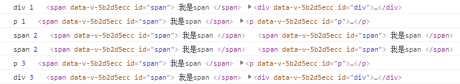
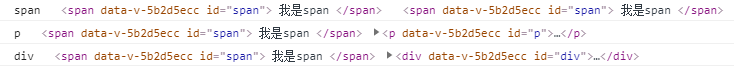
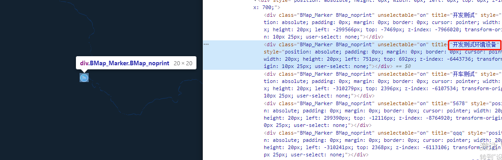

## 文件分批异步上传

假设每次上传文件至服务器就调用一次接口, 如果需要批量上传N个文件则需要调用N次接口, 并获取返回值:

实现上述需求非常简单, 首先 `<el-uploader>` 中将文件选中, 然后在 `file-list` 中遍历调用上传接口即可实现批量上传

这样会伴随一个问题: 这些文件何时**全部上传完毕**?

解决的方式也很简单, 使用到了 `Promise.all()` 函数

`Promise.all()` 接受一个数组, 数组内为需要批量调用的 `Promise`, 全部调用完成后进入`.then()`回调, 此时执行上传全部完成的逻辑即可

上述解决办法在文件数量在小批量范围内(数量级为百)是完全可行的, 然而新的问题是: 如果一次上传数量级为千甚至更多的文件会发生什么?

请求将会发送失败, 错误信息: 'net::ERR_INSUFFICIENT_RESOURCES' (网络错误, 资源不足), 当然后台也有一定的并发限制等问题

为了上传这几千个文件, 需要结合 `Promise.all()` 和 **递归** 来解决

由于文件数量庞大, 所以操作逻辑设计为**先选择好文件再统一点击上传, 而不是选择文件后立即自动上传, 减少服务器压力**

上代码:

```js{63-67}
  // template d

  <el-upload
    :file-list="fileList"
    :action="''"
    :on-change="handleChange"
    :on-remove="handleRemove"
    multiple
    :limit="5000"
    :auto-upload="false"
  >
    <el-button size="small" type="primary">点击选择文件</el-button>
  </el-upload>
  <el-button v-if="fileList.length > 0" @click="submitFiles">立即上传</el-button>

  
  // 引入API
  import API from '@/...'
  
  // data
  data() {
    return {
      importForm: {
        files: [], // 实际在form表单中暂存的已上传的文件url数组
      }
      fileList: [] // upload组件中保存的file数组
    }
  }

  // methods
  // 文件选择发生变化时调用, 使用钩子函数控制更新fileList, 同时也可以在此处理选择的文件
  handleChange((file, fileList) {
    // 这里以图片类型为例
    if (file.raw.type !== 'image/jpeg' && file.raw.type !== 'image/png' && file.raw.type !== 'image/bmp') {
      this.$message.warning('只支持 PNG/JPG/BMP 格式的图片')
      fileList.pop()
      return
    }
    // 文件大小限制, 超出限制的图片将自动移除
    if (file.size > 5242880) {
      this.$message.info('上传的图片不能大于5MB')
      fileList.pop()
    } else {
      // 确认无误则更新fileList
      this.fileList = fileList
    }
  },
  handleRemove(file, fileList) {
    this.fileList = fileList
  },
  submitFiles() {
    this.uploadBySteps(10, 0) // 从第0批开始, 一次上传10个文件
  },
  // 分布上传函数(递归调用)
  // step: 每一批次上传的文件个数
  // index: 当前批次的序列, 表示当前加载第(index+1)批次的文件
  uploadBySteps(step, index) {
    const currentLoadArray = [] // 当前批次的Promise数组
    for ( let i = 0; i < step; i++) {
      this.fileList[step * index + i] && currentLoadArray.push(this.uploadSingleFile(this.fileList[step * index + i]))
    }

    Promise.all(currentLoadArray).then(() => {
      if (this.fileList[(index + 1) * step]) { // 递归调用
        this.uploadBySteps(step, index + 1)
      }
    })
  },
  // 上传单个文件, 此处的file为upload组件中直接获取的file对象
  uploadSingleFile(file) {
    return new Promise((resolve, reject) => {
      const formData = new FormData()
      formData.append('label', 'nice')
      formData.append('file', file.raw)
      API.uploadFile(formData) // 这一步调用后台提供的上传接口即可
        .then(res => {
          // 调用成功即向importForm.files中添加url
          this.importForm.files.push({
            url: res.data
          })
          // 当importForm.files中的url数量和fileList中一致时, 则上传全部完成了, 执行后续操作即可
          if (this.importForm.files.length == this.fileList.length) {
            API.filesInsert(this.importForm).then(res => {
              this.globalLoading.close()
              if (res.status === 200) {
                this.$message.success('全部上传成功, 数据已导入!')
                // 如果是在dialog中时, 最好将数据清空
                this.importForm.files = []
                this.fileList = []
              } else {
                // 导入数据失败时也需要清空files
                this.importForm.files = []
                this.fileList = []
              }
            })
          }
          resolve('success')
        })
        .catch(error => {
          reject(error)
        })
    })
  }
```

## 文件的类型校验

在此列举总结常见文件的类型方便查阅:

文件类型|后缀名|编码
:-|:-|:-
图片|.jpg/.jpeg|`image/jpeg`
图片|.png|`image/png`
图片|.gif|`image/gif`

视频|.mp4|`video/mp4`
视频|.avi|`video/avi`
视频|.mpg|`video/mpeg`
视频|.wmv|`video/x-ms-wmv`
视频|.mov|`video/quicktime`

音频|.mp3|`audio/audio/mpeg`
音频|.aac|`audio/vnd.dlna.adts`
音频|.flac|`audio/flac`
音频|.m4a|`audio/audio/x-m4a`
音频|.wav|`audio/wav`
音频|.wma|`audio/x-ms-wma`

压缩文件|.zip|`application/x-zip-compressed`
压缩文件|.rar|``
压缩文件|.tar|`application/x-tar`
压缩文件|.tar.gz|`application/x-gzip`

## 色码的转换函数

```js
// 由十六进制色码转化为rgba格式的字符串
hexToRgba(hex, opacity = 1) {
  const reg = /^#([0-9a-fA-f]{3}|[0-9a-fA-f]{6})$/
  var sColor = hex.toLowerCase()
  if (sColor && reg.test(sColor)) {
    if (sColor.length === 4) {
      var sColorNew = '#'
      for (var i = 1; i < 4; i += 1) {
        sColorNew += sColor.slice(i, i + 1).concat(sColor.slice(i, i + 1))
      }
      sColor = sColorNew
    }
    //处理六位的颜色值
    var sColorChange = []
    for (let i = 1; i < 7; i += 2) {
      sColorChange.push(parseInt('0x' + sColor.slice(i, i + 2)))
    }
    return `rgba(${sColorChange.join(',')},${opacity})`
  } else {
    return sColor
  }
}
```

```js
hexToRgba('#0f0', 0.5)    // >> rgba(0,255,0,0.5)
hexToRgba('#00ff00', 0.5) // >> rgba(0,255,0,0.5)
```

## 将图片添加到canvas并输出为base64

核心是直接创建一个canvas元素, 此元素不插入至文档流中, 方法结束后会被清理

这里依赖了[v-viewer](https://mirari.cc/2017/08/27/Vue%E5%9B%BE%E7%89%87%E6%B5%8F%E8%A7%88%E7%BB%84%E4%BB%B6v-viewer%EF%BC%8C%E6%94%AF%E6%8C%81%E6%97%8B%E8%BD%AC%E3%80%81%E7%BC%A9%E6%94%BE%E3%80%81%E7%BF%BB%E8%BD%AC%E7%AD%89%E6%93%8D%E4%BD%9C/), 并且为了避免重复多次预渲染, 故采用API的方式调用, 由click事件触发

```js

```

```js
// data为包含url以及其余需要绘制信息的数据
openViewer(data) {
  const self = this
  const loading = this.$loading({
    lock: true,
    text: '图片渲染中...',
    spinner: 'el-icon-loading',
    background: 'rgba(0, 0, 0, 0.8)'
  })

  var url = data.url // 图片URL, 如果未配置代理需要完整地址
  var img = new Image()
  img.crossOrigin = 'Anonymous' // 解决Canvas.toDataURL 图片跨域问题
  img.src = url

  // 这里以绘制标注框为例
  // data.rects = [{"x": 300,"y": 600,"width": 100,"height": 200}]
  
  function createCanvas (width, height) {
    const canvas = document.createElement('canvas')
    canvas.setAttribute('width', width)
    canvas.setAttribute('height', height)
    const context = canvas.getContext('2d')

    context.drawImage(img, 0, 0, width, height)
    context.fillStyle = "rgba(255,0,0,0.3)"
    context.strokeStyle = "rgb(255,0,0)"
    context.lineWidth = 5
    if (data.rects.length > 0) {
      data.rects.forEach(rect => {
        context.strokeRect(rect.x, rect.y, rect.width, rect.height)
        context.fillRect(rect.x, rect.y, rect.width, rect.height)
      })
    }
    // 导出
    const base64Img = canvas.toDataURL('image/jpg')
    // 如果使用`app.use`进行全局安装, 你就可以像这样直接调用`this.$viewerApi`
    const $viewer = self.$viewerApi({
      images: [base64Img]
    })
    loading.close()
  }

  img.onload = (event) => {
    // 这里用path来读取img元素渲染后的内容
    createCanvas(event.path[0].width, event.path[0].height)
  }

  img.onerror = () => {
    loading.close()
    this.$message.error('图片加载失败!')
  }
}
```

## 事件捕获, 事件冒泡

在DOM事件绑定中, 通常会使用到`target`和`currentTarget`这两个属性, 区分这两个属性之前理一下JavaScript的事件流程

* **捕获(capture)** > **目标(target)** > **冒泡(bubbling)**

历史上微软和网景为了是究竟是捕获还是冒泡争执不下, 后来W3C表示这别打了这俩种方式都支持

```js
addEvenetListener(eventName, function, useCapture)
```

这第三个参数`useCapture`就是用来区分到底是在**冒泡**还是在**捕获**流程中触发事件函数
`true`: 捕获
`false`: 冒泡(默认)

### target、currentTarget

```js
<div id="div">
  <p id="p">
    <span id="span">
      我是span
    </span>
  </p>
</div>
```

```js
 document.getElementById('div').addEventListener(
  'click',
  event => {
    console.log('div', event.eventPhase, event.target, event.currentTarget)
  },
  true
)

document.getElementById('p').addEventListener(
  'click',
  event => {
    console.log('p', event.eventPhase, event.target, event.currentTarget)
  },
  true
)

document.getElementById('span').addEventListener(
  'click',
  event => {
    console.log('span', event.eventPhase, event.target, event.currentTarget)
  },
  true
)

document.getElementById('div').addEventListener(
  'click',
  event => {
    console.log('div', event.eventPhase, event.target, event.currentTarget)
  },
  false
)

document.getElementById('p').addEventListener(
  'click',
  event => {
    console.log('p', event.eventPhase, event.target, event.currentTarget)
  },
  false
)

document.getElementById('span').addEventListener(
  'click',
  event => {
    console.log('span', event.eventPhase, event.target, event.currentTarget)
  },
  false
)
```

点击 **我是span** 元素, 控制台输出如下



这里的`eventPhase`属性值就说明了当前事件处理程序的阶段

* 1: **捕获**阶段
* 2: **目标**阶段
* 3: **冒泡**阶段

可以看到事件实际上的顺序就是最开始提到的顺序:

1. div 1 (捕获)
2. p 1 (捕获)
3. span 2 (目标)
4. span 2 (目标)
5. p 3 (冒泡)
6. div 3 (冒泡)

::: tip

* 目标过程其实执行了两遍, **捕获的结尾**和**冒泡的开始**都是目标过程
:::

所以`target`是事件真实触发的元素, 而`currentTarget`是事件流进行过程中的当前元素

再换成更常见的vue写法, 这里就不再输出`eventPhase`属性了:

```html
<div id="div" @click="handleDivClicked">
  <p id="p" @click="handlePClicked">
    <span id="span" @click="handleSpanClicked">
      我是span
    </span>
  </p>
</div>
```

```js
methods: {
  handleDivClicked(event) {
    console.log('div', event.target, event.currentTarget)
  },
  handlePClicked(event) {
    console.log('p', event.target, event.currentTarget)
  },
  handleSpanClicked(event) {
    console.log('span', event.target, event.currentTarget)
  }
}
```

点击 **我是span**, 然后再观察控制台输出:



* 由于事件默认是按冒泡的方式, 所以先由触发元素本身响应, 再向上冒泡依次响应
* 因为`target`是真实触发的元素, 所以三个`target`全部输出为`span`元素;
* `handleSpanClicked`事件由于是其本身触发, `currentTarget`与`target`一致;
* `p`和`div`都是冒泡触发, 他们并不是本身触发了事件, 所以这两个事件的`target`都是真正触发的源头`span`元素, 而`currentTarget`才是这两个元素本身

### 快问快答

思考下方几种情况下, 点击 `我是高级span` 的三个事件的输出以及顺序

```html
<div id="div" @click.capture="handleDivClicked">
  <p id="p" @click="handlePClicked">
    <span id="span" @click.stop="handleSpanClicked">
      我是高级span
    </span>
  </p>
</div>
```

::: details 结果

1. div
2. span

:::

```html
<div id="div" @click.self="handleDivClicked">
  <p id="p" @click.capture="handlePClicked">
    <span id="span" @click="handleSpanClicked">
      我是高级span
    </span>
  </p>
</div>
```

::: details 结果

1. p
2. span

:::

```html
<div id="div" @click.capture="handleDivClicked">
  <p id="p" @click.stop="handlePClicked">
    <span id="span" @click.capture="handleSpanClicked">
      我是高级span
    </span>
  </p>
</div>
```

::: details 结果

1. div
2. span
3. p

:::

### 阻止事件传播 和 阻止默认行为

当需要停止冒泡时, 除了vue中的`.stop`事件修饰符, 在`addEventListener(event, function)`中最后调用`event.stopPropagation()`, 这样函数就不会冒泡或者被捕获了

同样, 有的元素会有默认行为, 例如点击a标签会跳转, 拖拽图片可以在新标签页中打开它, `<input type=submit />`会自动提交表单等, 当需要阻止默认行为时, 调用event内的方法`event.preventDefault()`

### 事件委托(冒泡的应用)

如果需要给多个元素绑定事件, 或许会采用这种方式:

```html
<ul id="ul">
  <li class="li">li 1</>
  <li class="li">li 2</>
  <li class="li">li 3</>
  <li class="li">li 4</>
</ul>
```

```js
const lis = document.getElementsByClassName('li')
lis.forEach(li => {
  li.addEventListener('click', event => {
    console.log(event.target.innerHTML)
  })
})
```

这样会重复添加很多重复的事件, 利用事件冒泡的特性, 可以委托给ul元素, 让ul通过冒泡来执行事件

```js
const ul = document.getElementById('ul')
ul.addEventListener('click', event => {
  console.log(event.target.innerHTML)
})
```

* 事件委托的另一个优点是如果新加入的子元素, 无需重复添加事件, 同样能被捕获冒泡响应到

## BaiduMap GIF Marker(Icon)类

[百度地图JavaScript API - Marker类](https://mapopen-pub-jsapi.bj.bcebos.com/jsapi/reference/jsapi_reference_3_0.html#a3b2)

[百度地图JavaScript API - Icon类](https://mapopen-pub-jsapi.bj.bcebos.com/jsapi/reference/jsapi_reference_3_0.html#a3b5)

Baidu地图可以根据经纬度坐标( `lat`(Latitude纬度`0 ~ 90`), `lng`(Longtitude经度`0 ~ 180`) )生生成 `Marker` 类放置在地图上, 但是百度实现方式是将用到的图片资源压缩成了一张sprite图(在设置offset属性如果值不合适时会显示出其他图片资源), 这就导致了 `Icon` 类并**不能直接设置动态GIF图**

实现方法: 给已经生成的Marker元素追加样式CSS(坑很多, 本小节慢慢踩)

### 1. 渲染并到目标元素

首先先创建一个Marker元素并渲染在Map上
```js
// 渲染地图部分略(BMapGL)...

const markerPoint = new BMapGL.Point(Number(118.888888), Number(28.888888));
// 这里的代码都是从项目中复制的
const myIcon = new BMapGL.Icon(iconUrl, new BMapGL.Size(20, 20), {
  anchor: new BMapGL.Size(10, 25),
  imageOffset: new BMapGL.Size(0, 0),
  imageSize: new BMapGL.Size(20, 20)
});
const marker = new BMapGL.Marker(markerPoint, { icon: myIcon });
marker.setTitle(data.name);
this.mapObj.addOverlay(marker);
```

这样渲染出来的Marker DOM就成功显示出来了, 但是还有点问题, 就是所有的Marker对象元素都是同样的`class="BMap_Marker"`, 查阅了一下API, 没有给其Marker单独赋值class的方法, 好在天无绝人之路, 这个Marker可以赋值一个title属性:



那就只有在这个`title`属性上做文章, 给需要放上gif的Marker的`title`中添加一些特殊的标志性文本: *"(轻度)"*, *"(中度)"*, *"(重度)"* 这种**不会跟Marker本身代表的含义出现重叠的文字**

然后的事情就是根据这个程度来执行不同的渲染逻辑

```js
// 在marker添加完成后的回调中重新设置样式
this.mapObj.addEventListener("tilesloaded", e => {
  if (this.mapObj.getOverlays() && this.mapObj.getOverlays().length > 0) {
    document.getElementsByClassName("BMap_Marker").forEach(item => {
      if (item.title.indexOf("轻度") != -1) {
        item.style.backgroundImage = `url(${iconGreen.base64})`;
        item.style.backgroundSize = "100% 100%";
      }
      if (item.title.indexOf("中度") != -1) {
        item.style.backgroundImage = `url(${iconYellow.base64})`;
        item.style.backgroundSize = "100% 100%";
      }
      if (item.title.indexOf("重度") != -1) {
        item.style.backgroundImage = `url(${iconRed.base64})`;
        item.style.backgroundSize = "100% 100%";
      }
    });
  }
});
```

~~后话: 高德地图, 腾讯地图直接可以使用GIF...~~