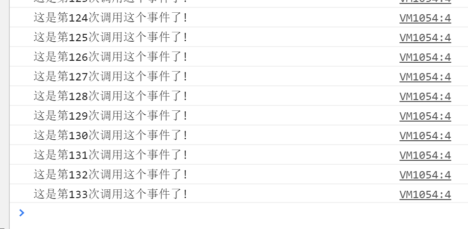

## 写在前面
虽然前人栽的大树([lodash](https://www.lodashjs.com/))已经足够乘凉了, 但是用归用, 这防抖和节流的知识以及原理还是要掌握呀, 那么本文就来探讨下这个, 参考了掘金上一堆文章, 然后自己来总结下。

### 为啥要做防抖和节流?
你是否遇到过写 `mousemove` 、`scroll` 或是 `resize`, 这类事件从触发开始到结束, 会以毫秒级不停调用非常非常多次, 这无疑加大了对内存的占用, 于是你的网页开始卡了...

就拿 `mousemove`来举例:

```js
var container = document.getElementsByTagName('body')[0];
var count = 1
function getUserAction() {
  console.log(`这是第${count++}次调用这个事件了!`);
};

container.onmousemove = getUserAction;
```

然后鼠标在页面上随便划拉几下, 就会发现事件疯狂调用了一百多次:



当然, 现在浏览器处理这点小事还是绰绰有余, 即使毫秒级别为间隔也给你同步处理好了, 但是如果 `getUserAction` 函数内复杂一点, 例如大量的数据修改、 I/O、 异步请求等, 浏览器就不见得能顺滑地处理这么大批的任务了, 所以为了解决这个隐患, 就得请出本文的主角: **防抖 debounce** 和 **节流 throttle**
## 防抖 debounce
防抖的意思是: 
如果你在一段时间内一直触发事件, 只允许 初始在第 n 秒后 或者 上一次事件执行完后的第 n 秒才开始再次执行, 如果在等待的这 n 秒内又触发了, 那么刷新这个计时器, 重新计算 0 ~ n 秒的这个过程。

简而言之就是: 等这个一直活跃的**触发源头**(`onmousemove`) 停下来之后的第 n 秒, **处理函数**(`getUserAction`)才执行。

### 初步实现
```js {8-14,16}
var container = document.getElementsByTagName('body')[0];
var count = 0

function getUserAction() {
  console.log(`这是第${count++}次调用这个事件了!`);
};

function debounce(func, waitTime) {
  var timeout;
  return function () {
    clearTimeout(timeout) // 重新触发时重置定时器
    timeout = setTimeout(func, waitTime);
  }
}

container.onmousemove = debounce(getUserAction, 1000);
```
现在变成了, 从你开始晃鼠标开始, 如果不停下来, `getUserAction` 这个函数是不会执行的, 极大的减少了不需要的内存占用!

### this 的指向问题
现在将打印的内容改为 `console.log(this)`, 看看在使用和不使用刚刚写的防抖函数的情况下, 输出了些什么


在调用防抖函数后, `this` 的指向竟然跑到 window 对象上去了, 这是因为这里产生了闭包:


于是就要请出我们的借刀杀..哦不借物达人 [call / apply](../studyBasement/Call&Apply&Bind.md) 来将this指向变回 `<body>` 对象:

```js {5,9}
function debounce(func, waitTime) {
  var timeout;
  console.log(this)
  return function () {
    var self = this;

    clearTimeout(timeout)
    timeout = setTimeout(function(){
      func.apply(self) // 用 call() 也一样
    }, waitTime);
  }
}
var container = document.getElementsByTagName('body')[0];

function getUserAction() {
  console.log(this);
};

container.onmousemove = debounce(getUserAction, 1000);
```

好了, 现在指向正确啦!

## 节流 throttle