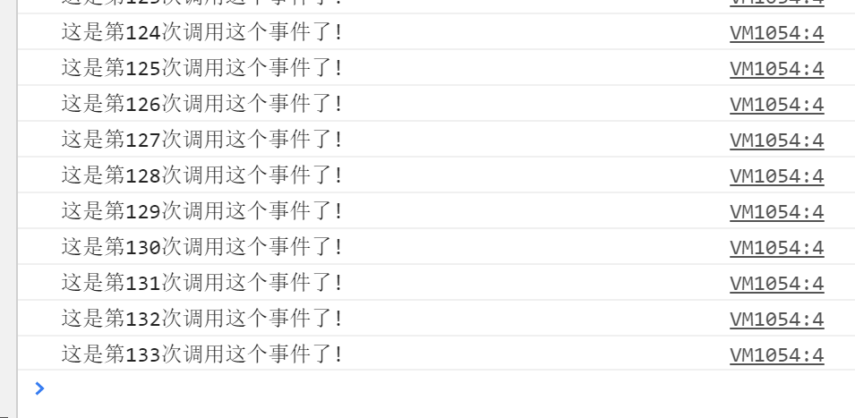
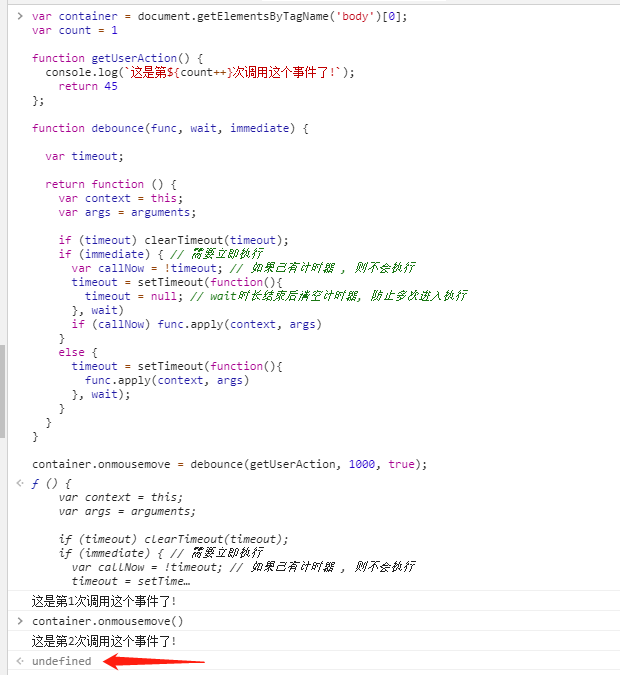
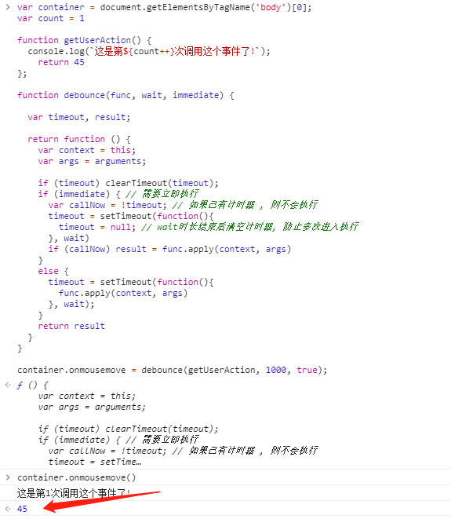

## 写在前面

虽然前人栽的大树([lodash](https://www.lodashjs.com/)) , ([underscore](https://underscorejs.net/))已经足够乘凉了, 但是用归用, 这防抖的知识以及原理还是要掌握呀, 那么本文就来探讨下这个, 参考了掘金上一堆文章, 然后自己来总结下。

还有一篇 [节流 throttle](./Debounce.md) 哦

## 为啥要做防抖

你是否遇到过写 `mousemove` 、`scroll` 或是 `resize`, 这类事件从触发开始到结束, 会以毫秒级不停调用非常非常多次, 这无疑加大了对内存的占用, 于是你的网页开始卡了...

就拿 `mousemove`来举例:

```js
var container = document.getElementsByTagName('body')[0];
var count = 1
function getUserAction() {
  console.log(`这是第${count++}次调用这个事件了!`);
};

container.onmousemove = getUserAction;
```

然后鼠标在页面上随便划拉几下, 就会发现事件疯狂调用了一百多次:



当然, 现在浏览器处理这点小事还是绰绰有余, 即使毫秒级别为间隔也给你同步处理好了, 但是如果 `getUserAction` 函数内复杂一点, 例如大量的数据修改、 I/O、 异步请求等, 浏览器就不见得能顺滑地处理这么大批的任务了, 所以为了解决这个隐患, 就得请出本文的主角: **防抖 debounce**

## 防抖 debounce

防抖的意思是:
如果你在一段时间内一直触发事件, 只允许 初始在第 n 秒后 或者 上一次事件执行完后的第 n 秒才开始再次执行, 如果在等待的这 n 秒内又触发了, 那么刷新这个计时器, 重新计算 0 ~ n 秒的这个过程。

简而言之就是: 等这个一直活跃的**触发源头**(`onmousemove`) 停下来之后的第 n 秒, **处理函数**(`getUserAction`)才执行。

## 初步实现

```js {8-14,16}
var container = document.getElementsByTagName('body')[0];
var count = 1

function getUserAction() {
  console.log(`这是第${count++}次调用这个事件了!`);
};

function debounce(func, wait) {
  var timeout;
  return function() {
    clearTimeout(timeout) // 重新触发时重置定时器
    timeout = setTimeout(func, wait);
  }
}

container.onmousemove = debounce(getUserAction, 1000);
```

现在变成了, 从你开始晃鼠标开始, 如果不停下来, `getUserAction` 这个函数是不会执行的, 极大的减少了不需要的内存占用!

## this 的指向错误

现在将打印的内容改为 `console.log(this)`, 看看在使用和不使用刚刚写的防抖函数的情况下, 输出了些什么


正确的指向应该是 `body` 对象, 但由于

关于这个 `this` 指向问题, 先看如下这个小例子, 或者看 [this 的指向规则](../JavaScript/This&Context&Scope.md#指向规则):

```js
var num = 1
var obj = {
  num: 2,
  getNum: function name1() {
    console.log(this) // 指向obj
    return (function () {
      console.log(this) // 指向window
      return this.num;
    })();
  }
}

obj.getNum(); // >> 1
```

言归正传, 请出我们的借刀杀..哦不借物达人 [call / apply](../JavaScript/Call&Apply&Bind.md) 来将this指向变回 `body` 对象:

```js {5,9}
var container = document.getElementsByTagName('body')[0];
var count = 1

function debounce(func, wait) {
  var timeout;
  console.log(this) // >> window
  return function() {
    var self = this; // 这里的 this 实际指向 <body>

    clearTimeout(timeout)
    timeout = setTimeout(function() {
      func.apply(self) // 用 call() 也一样
    }, wait);
  }
}

function getUserAction() {
  console.log(this); // >> <body>
  console.log(`这是第${count++}次调用这个事件了!`);
};

container.onmousemove = debounce(getUserAction, 1000);
```

好, 相信你已经看过关于 this 的内容了, 解释一下这里为啥 this 有不同的指向:

* 首先 `debounce` 是在 `window` 环境下执行的, 所以在 `debounce` 内部, `this` 是指向 `window`
* 然后 `debounce` 返回了一个函数, 这个函数真正被 `onmousemove` 执行, 所以在这里的 `this` 指向 `<body>`

好了, 现在指向正确啦!

## event去哪儿了

处理完了 `this` , 我们再来检查一下加入防抖后的JavaScript事件自带的 `event` 对象是否正确:

```js
function getUserAction(e) {
  console.log(e);
};
```

它果然不负众望地整错了→_→ , 它输出了 `undefined` , 这是因为在借方法时没有把默认参数带上, 那么我们把该有的参数还给它, 修改 `debounce` 函数

```js {6,10}
function debounce(func, wait) {
  var timeout;

  return function() {
    var self = this;
    var args = arguments; // 引用函数的实参

    clearTimeout(timeout)
    timeout = setTimeout(function() {
      func.apply(self, args) // 这里就不能用call了
    }, wait);
  }
}
```

## 我不想等

到目前为止, 还有个小问题, 那就是防抖函数必须要 '等' 到计时结束, 才会执行第一次, 如果间隔较短, 那用户还能忍, 但是防抖间隔较长, 就没那么好受了, 于是我们再来改造一下它, 让它可以立即执行并在停止 n 秒后才可以重新触发:

```js {9-16}
function debounce(func, wait, immediate) {

  var timeout;

  return function() {
    var context = this;
    var args = arguments;

    if (timeout) clearTimeout(timeout);
    if (immediate) { // 需要立即执行
      var callNow = !timeout; // 如果已有计时器 , 则不会执行
      timeout = setTimeout(function() {
        timeout = null; // wait时长结束后清空计时器, 防止多次进入执行
      }, wait)
      if (callNow) func.apply(context, args)
    }
    else {
      timeout = setTimeout(function() {
        func.apply(context, args)
      }, wait);
    }
  }
}
```

## 函数返回值

一个函数除了有参数 , 还会有返回值哦, 所以 `getUserAction()` 也是可能有返回值的哦, 在上一版的代码中给 `getUserAction()` 添加返回值, 再调用这个事件, 会发现`return undefined`



当 `immediate` 为 `false` 的时候，因为使用了 `setTimeout` ，我们将 `func.apply(context, args)` 的返回值赋给变量，最后再 `return` 的时候，值将会一直是 `undefined` ，所以我们只在 `immediate` 为 true 的时候返回函数的执行结果。

```js
function debounce(func, wait, immediate) {

  var timeout, result;

  return function() {
    var context = this;
    var args = arguments;

    if (timeout) clearTimeout(timeout);
    if (immediate) { // 需要立即执行
      var callNow = !timeout; // 如果已有计时器 , 则不会执行
      timeout = setTimeout(function() {
        timeout = null; // wait时长结束后清空计时器, 防止多次进入执行
      }, wait)
      if (callNow) result = func.apply(context, args)
    }
    else {
      timeout = setTimeout(function() {
        func.apply(context, args)
      }, wait);
    }
    return result
  }
}
```



## 取消防抖

最后一个问题了, 如果我想取消防抖该咋整呢 , 这也是一个很合理的需求, 那么我们开始吧 , 首先让 `debounce` 函数 `return` 一个变量 `debonced`, 并且给这个变量注册一个 `cancel` 方法。

```js {5,24-27}
function debounce(func, wait, immediate) {

  var timeout, result;

  var debonced = function() {
    var context = this;
    var args = arguments;

    if (timeout) clearTimeout(timeout);
    if (immediate) { // 需要立即执行
      var callNow = !timeout; // 如果已有计时器 , 则不会执行
      timeout = setTimeout(function() {
        timeout = null; // wait时长结束后清空计时器, 防止多次进入执行
      }, wait)
      if (callNow) result = func.apply(context, args)
    }
    else {
      timeout = setTimeout(function() {
        func.apply(context, args)
      }, wait);
    }
    return result
  }
  debounced.cancel = function() {
    clearTimeout(timeout)
    timeout = null
  }
  return debounced
}
```

我们来试用一下这个取消防抖

```js
...
var setUseAction = debounce(getUserAction, 10000, true);
container.onmousemove = setUseAction;

// 随便找个元素
document.getElementById("button").addEventListener('click', function() {
  setUseAction.cancel();
})
```

至此, 防抖函数完成
