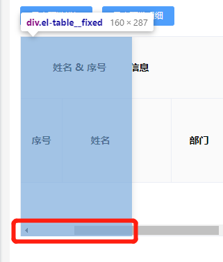

## 技巧与要点
### 表格的固定表头与最大高度
官方文档描述为直接添加`height`属性, 但是通常情况下, 我们更希望是根据数据的长度动态控制, 当达到一定数量时才进行高度限制

故更建议直接使用`max-height`进行指定最大高度

你可能会更常遇到这种需求: "给表格添加动态的最大高度, 使其正好完整填充当前视图。"

而 `max-height` 则只支持 `number/string` 类型的参数, 此时则需要动态输入计算后的高度值, 可以依托 `computed` 实现:

```js
  ...
  // template
  <el-table
    :max-height="maxTableHeight(600)"
    >
  ...
  </el-table>

  ...
  //js
  computed: {
    maxTableHeight() {
      return (height) => {
        window.innerHeight - height
      }
    },
  }
  ...
```

### DatePicker的处理逻辑
在某些情况下，时间选择器并非固定使用range类型，此时需要自行进处理时间先后的判断逻辑，可按照下方逻辑进行使用:

两个时间选项各自独立，但遇到不合理时间时强行修改另一个时间
```JavaScript
...
watch: {
  'form.startDate': { // 开始日期
    handler(newV, oldV) {
      if(!newV) {
        return
      }
      if(this.form.endDate && newV > this.form.endDate) {
        this.form.endDate = newV
      }
    }
  },
  'form.endDate': { // 结束日期
    handler(newV, oldV) {
      if(!newV) {
        return
      }
      if(this.form.startDate && newV < this.form.startDate) {
        this.form.startDate = newV
      }
    }
  },
}
...
```

### 组件事件的额外参数问题
在某些组件中, 经常会用到 change/blur 等事件, 但组件本身只传递其本身附带的内容, 但在更广泛的应用中我们还需要传递额外的参数

将组件参数修改为如下即可

```HTML
  <el-select @change="handleChange($event, 'otherProp')">
    ...
  </el-select>
```

```JavaScript
  handleChange($event, prop) {
    console.log(prop) // 'otherProp'
  }
```


## 潜在问题

### Table无数据的高度异常
在固定了表格的情况下, 若出现无数据的情况时, 则会导致如下情况发生:



此时为无数据时添加动态的class以及对应的样式即可:
```css
  /* 自定义的class "no-data-table" */
  .no-data-table .el-table__fixed,
  .no-data-table .el-table__fixed-right {
    height: calc(100% - 15px); /* 根据当前的滚动条自行适配高度 */
    border-bottom: none;
  }
  .no-data-table .el-table__fixed:before,
  .no-data-table .el-table__fixed-right:before {
    display: none;
  }
```

**`.el-table__fixed:before`表现为底部的边框, 在没有出现滑动条时并不期望其出现**


