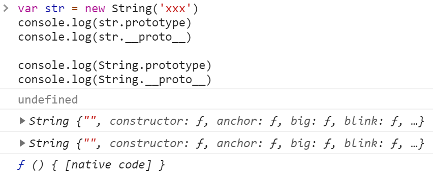

为了防止忘记和生疏, 在这篇文章下记录

## 原型 & 原型链

在JavaScript 中, 创建实例化对象是由构造函数来进行创建的, 每个构造函数都有自己的 `prototype` 属性, 这个属性是一个 **对象**, 对象包含了**可由该构造函数产生的所有实例** 共享的属性和方法, 所以当使用构造函数穿件一个新对象后, 在这个新的对象内部包含一个指针 `__proto__`, 指向其构造函数的 `prototype` 的值, 也就是对象的 **原型**。


再来说说原型链:

例如当你要访问一个对象 `obj` 的 `name` 属性时, 如果这个 `obj` 对象内部不存在 `name` 这个属性, `obj` 对象会去寻找它原型对象里的 `name` 属性, 其原型对象也是有原型的, 如此一直寻找原型, 原型的原型, 直到找到 `name` 属性或者到达 **原型链** 的末尾。

### prototype & \_\_proto\_\_

刚刚提到了这个私有属性 `__proto__`, 它指向其构造函数的原型 `prototype`, 当然构造函数自己也有 `__proto__`

说一下这俩有啥区别:

* `prototype` 是一个 **属性**, 包含了其构造函数所能提供的所有 **属性** 和 **方法**
* `__proto__` 是一个 **指针**, 引用其原型的 `prototype`

注意: **基本数据类型是没有 `prototype` 属性的**, 但是可以通过 `__proto__` 属性让我们访问到其 **原型** 的 `prototype`



```js
var F = function() {}

Object.prototype.a = function(){ console.log('a') }
Function.prototype.b = function(){ console.log('b') }

var f = new F()

f.a()
f.b()

F.a()
F.b()
```

::: details 查看答案

```js
f.a() // >> 'a'
f.b() // >> error

F.a() // >> 'a'
F.b() // >> 'b'
```

:::

再来看这张图:


* `Foo` 是实例化的 `Function`, 它们的 `__proto__` 都指向 `Function.prototype`
* 原型链的尽头: `Object.prototype.__proto__`

最后来验证一下:


