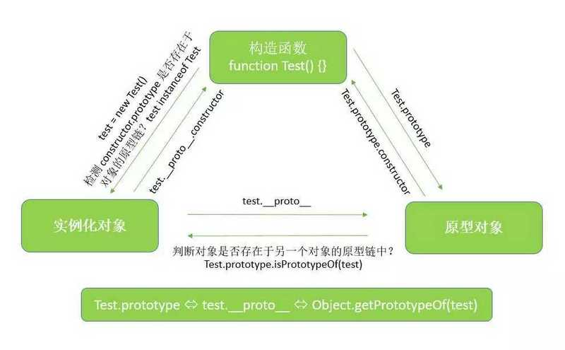
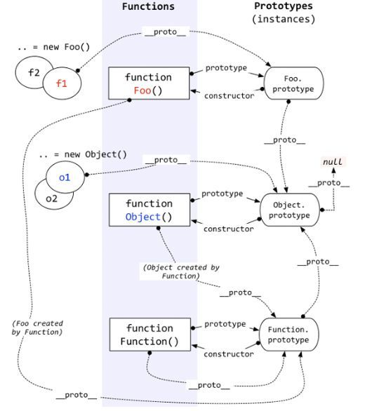
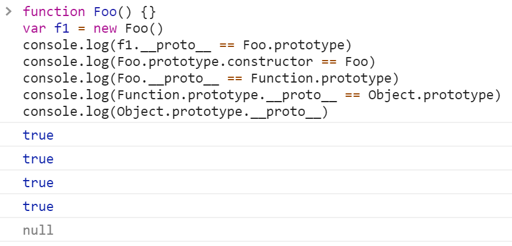
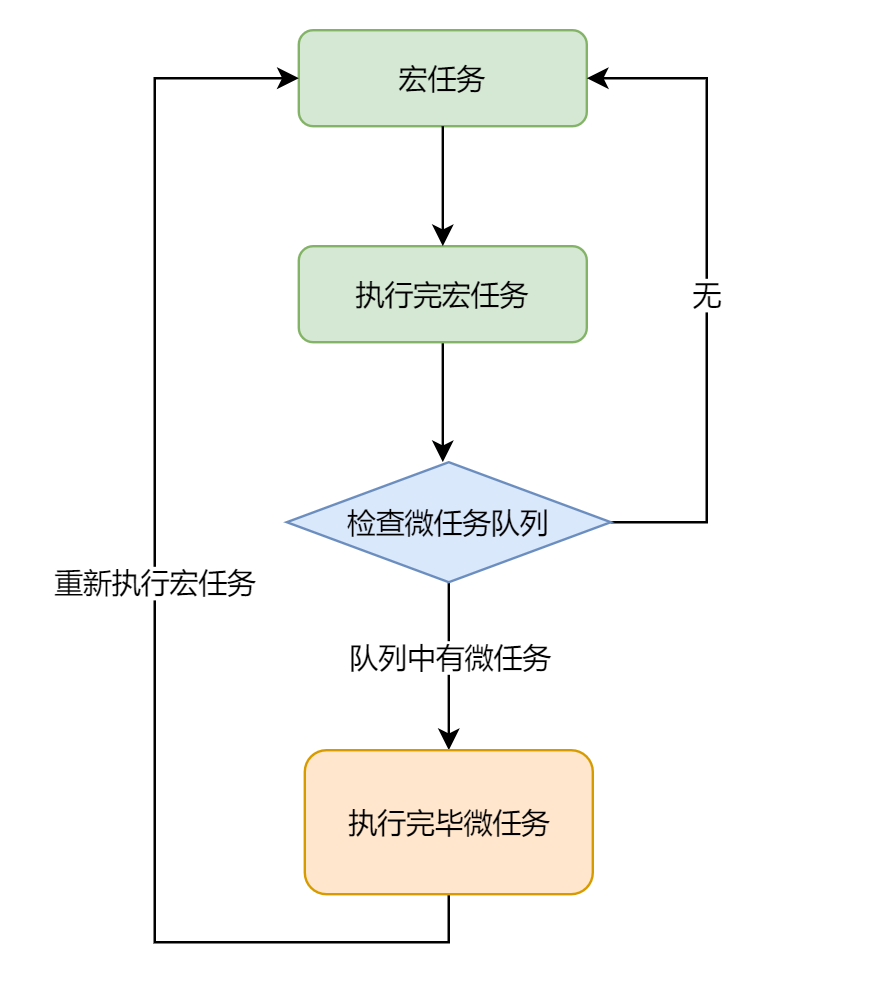

为了防止忘记和生疏, 在这篇文章下记录

## 原型 & 原型链

在JavaScript 中, 创建实例化对象是由构造函数来进行创建的, 每个构造函数都有自己的 `prototype` 属性, 这个属性是一个 **对象**, 对象包含了**可由该构造函数产生的所有实例** 共享的属性和方法, 所以当使用构造函数穿件一个新对象后, 在这个新的对象内部包含一个指针 `__proto__`, 指向其构造函数的 `prototype` 的值, 也就是对象的 **原型**。



再来说说原型链:

例如当你要访问一个对象 `obj` 的 `name` 属性时, 如果这个 `obj` 对象内部不存在 `name` 这个属性, `obj` 对象会去寻找它原型对象里的 `name` 属性, 其原型对象也是有原型的, 如此一直寻找原型, 原型的原型, 直到找到 `name` 属性或者到达 **原型链** 的末尾。

### prototype & \_\_proto\_\_

刚刚提到了这个私有属性 `__proto__`, 它指向其构造函数的原型 `prototype`, 当然构造函数自己也有 `__proto__`

说一下这俩有啥区别:

* `prototype` 是一个 **属性**, 包含了其构造函数所能提供的所有 **属性** 和 **方法**
* `__proto__` 是一个 **指针**, 引用其原型的 `prototype`

注意: **基本数据类型是没有 `prototype` 属性的**, 但是可以通过 `__proto__` 属性让我们访问到其 **原型** 的 `prototype`

```js
var F = function() {}

Object.prototype.a = function(){ console.log('a') }
Function.prototype.b = function(){ console.log('b') }

var f = new F()

f.a()
f.b()

F.a()
F.b()
```

::: details 查看答案

```js
f.a() // >> 'a'
f.b() // >> error

F.a() // >> 'a'
F.b() // >> 'b'
```

:::

再来看这张图:



* `Foo` 是实例化的 `Function`, 它们的 `__proto__` 都指向 `Function.prototype`
* 原型链的尽头: `Object.prototype.__proto__`

最后来验证一下:



## Event Loop

JavaScript 是单线程的, 这是因为JavaScript的用途就是增强用户在网页上的交互和操作DOM, 假如是多线程的话, 那么就会出现一个线程去删除了一个DOM节点, 另一个线程又要使用这个DOM节点, 这时浏览器就会不知道以哪个线程为准了。

### 任务队列

基于单线程的机制, 所有任务都得排队依次执行, 如果前一个任务过于耗时, 那么后面的任务也不得不等
到前面的执行完才能开始。

问题在于这个等待的过程中其实很多时候处理器是空闲的, 它也在等待, 例如 I/O 或 异步从服务器获取数据, 这时则可以完全把等待着的处理器派去继续执行队列后的任务, 等到I/O返回了结果, 再回过头来执行I/O接下来的任务(这里就是回调 callback)。

这样一来, 任务就被划分成了两种: **同步任务**(synchronous) 和 **异步任务** (asynchronous)

* **同步任务**: 在主线程上排队执行的任务
* **异步任务**: 不进入主线程, 而是进入任务队列 (task queue), 异步任务在需要时才会进入主线程执行

### 宏任务 & 微任务

* **macrotask（宏任务）：**
  script(整体代码)
  XHR回调
  事件回调（鼠标键盘事件）
  setTimeout/setInterval
  I/O
  UI rendering
* **microtask（微任务）：**
  Promises.then, MutationObserver

这两种任务分属于不同的任务队列, 宏任务有宏任务队列, 微任务有微任务队列, 两者互相独立

微任务不会立即执行,, 在宏任务栈执行完毕后, 才开始调用微任务的队列进行执行

::: tip `setTimeout` 和 `setInterval`
可以发现这两个是宏任务, 按理说应该立即执行, 但是他们都是异步任务, 实际执行的内容其实是其回调函数, 所以同步任务执行到他们时, 会将其注册到宏任务队列中, 等待当前栈内将微任务调用结束后再调用
:::

### 事件循环 Event Loop

有了上面的概念, 可能还有点一知半解, 现在来正式说明事件循环 Event Loop:

首先将当前执行环境中所有**宏任务**推入执行栈(call stack)内依次执行, 全部执行完毕后, 开始执行过程中产生的**微任务队列**中的所有任务, 微任务完成后再次查询同步任务的队列, 如此往复。

::: tip 注意 `setTimeout` 和 `setInterval`
他们都是宏任务, 但其回调函数会被放入**宏任务队列**中, 等待下一次循环再执行
:::


来看一个例子, 先试试找出全部的输出顺序, 然后再解答:

```js
console.log('1');

setTimeout(function() {
  console.log('2');
  new Promise(function(resolve) {
    console.log('3');
    resolve();
  }).then(function() {
    console.log('4')
  })
})

new Promise(function(resolve) {
  console.log('5');
  resolve();
}).then(function() {
  console.log('6')
})

setTimeout(function() {
  console.log('7');
  new Promise(function(resolve) {
    console.log('8');
    resolve();
  }).then(function() {
    console.log('9')
  })
 console.log('10');
})

console.log('11');
```

::: details 查看结果
1
5
11
6
2
3
4
7
8
10
9
:::

我们来分析一下到底发生了什么:

第一轮:

* 直接输出 1, 没有问题
* 遇到第一个`setTimeout`(我们将它标记为`time1`), 将其放入宏队列, 暂不执行
* 实例化Promise, 宏任务, 立即执行, 输出 5
* resolve() 属于微任务, 放入微队列
* 再次遇到第二个 `setTimeout`(我们将它标记为`time2`), 同样放入宏队列, 暂不执行
* 最后输出 11
* 宏任务至此一轮结束, 开始执行微队列的任务, 立即输出 6

第二轮:

* 这里执行宏队列的第一个 `time1`, 输出 2
* 实例化Promise, 依然是宏任务, 输出 3
* 再次resolve(), 放入微队列
* 当前执行域内没有宏任务了(`time2`不在当前执行域内), 执行微队列的任务, 输出 4

第三轮:

* 然后轮到 `time2`, 输出 7
* 还是实例化Promise, 输出 8
* resolve() 进入微队列
* 输出 11, 至此当前宏任务执行完毕
* 执行微队列的任务, 输出 9
