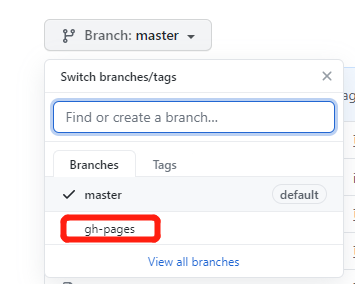
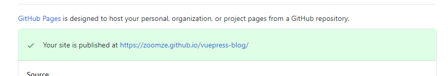
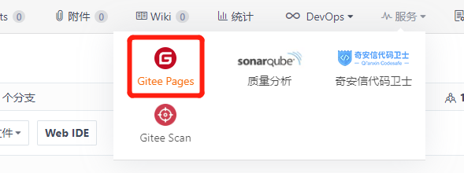
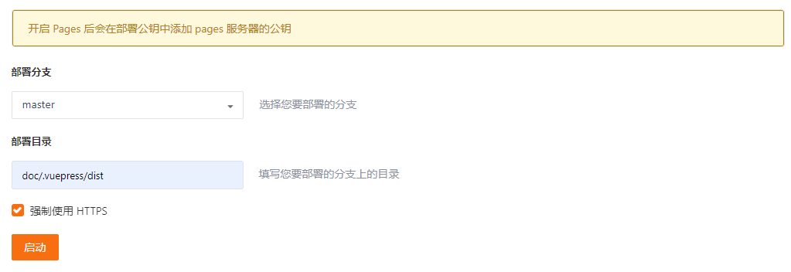
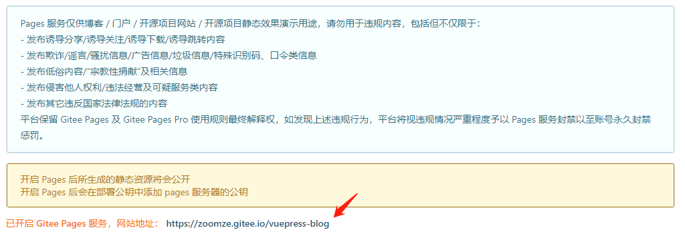
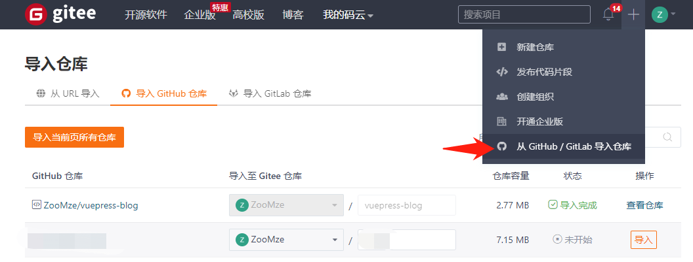

本文的两种部署方式, 均默认为你的代码仓库在对应的代码托管平台下已经创建好, 例如如果想在Gitee的代码部署到Github, 则需要你重新创建库再进行操作

## 部署到Github

这里可以参考 [官网文档](https://vuepress.vuejs.org/zh/guide/deploy.html#github-pages)

### 部署
本文的部署情况皆为举例, 你需要按实际情况进行修改。进入正题, 将文档部署到附带 `base` ( vuepress-blog )路径的地址下:
首先在 config.js 下确认dist输出位置和 `base` 的配置:

```js
export default {
  ...
  "dest": "dist", // 输出路径
  "base": '/vuepress-blog/', // 部署的base路径
  ...
}
```

确认好后在项目根目录下创建git脚本文件 deploy.sh, 并添加以下内容:

```sh
#!/usr/bin/env sh

# 确保脚本抛出遇到的错误
set -e

# 生成静态文件
npm run docs:build

# 进入生成的文件夹
cd dist

# 如果是发布到自定义域名
# echo 'www.example.com' > CNAME

git init
git add -A
git commit -m 'deploy'

# 如果发布到 https://<USERNAME>.github.io
# git push -f git@github.com:<USERNAME>/<USERNAME>.github.io.git master

# 如果发布到 https://<USERNAME>.github.io/<REPO>
git push -f git@github.com:ZooMze/vuepress-blog.git master:gh-pages

cd -
```

::: danger 警告
确保你的电脑已配置了正确的秘钥SSH, 否者你将无法按照上述的方式的推送代码!
本站有一篇内容介绍如何配置: [配置本机的GitHub的SSH](./SettingSSH.md)

\* 如果你不想配置SSH, 则需要手动添加分支gh-pages, 并在每次更修改后切换分支并提交更新
:::

::: warning 注意
deploy.sh执行的script的命令需要跟package.json里的保持一致
:::

以上内容执行完成后, 回到你的项目仓库中, 新的分支已被创建好, 这个分支仅仅只有 **dist内的文件**:



build的代码已自动提交了, 然后进入 Settings , 找到 Github Page, 并在 Source 选项选中刚刚添加的分支:


选中后 再在 Github Page > Custom domain 中 填写好 `base`: vuepress-blog, 点击保存即可



部署成功: [https://zoomze.github.io/vuepress-blog/](https://zoomze.github.io/vuepress-blog/)

### 更新
更新很简单, 重新运行 deploy.sh 脚本即可更新

## 部署到Gitee

### 部署
部署到 Gitee 更加直观简单, \*这里按照没有按上述方式配置 deploy.sh 的方式进行提交和更新。

build代码前, 先还是确认 `base`的配置路径, 与部署到gitHub稍有不同:

```js {3}
export default {
  ...
  "base": '/vuepress-blog/', // 注意 这里是你的代码仓库名
  ...
}
```

然后将你的代码打包并提交到Gitee上, 现在进入Gitee你的仓库地址, 选择服务, 找到Gitee Pages 



选择master分支, 或者你需要发布的分支, 并指定部署目录



点击启动



部署成功: [https://zoomze.gitee.io/vuepress-blog/](https://zoomze.gitee.io/vuepress-blog/)

### 更新
由于没有自动脚本帮我们自动提交和更新, 所以需要你手动上传build代码来更新

## Gitee 同步 GitHub
### 导入代码
可能你会遇到这种情况: 我的代码在Github上, 但是我又想使用Gitee在国内访问的速度优势让我的主页打开快一点, 这时候就需要同步一下两边的代码, 首先我们来导入代码仓库:

::: warning 注意
确保你的Gitee当前仓库没有重名的仓库(不区分大小写)
:::




同步完成后再次找到 Gitee Pages, 注意这里部署分支要选择跟github一样的 gh-pages分支:


::: warning 注意
这里部署目录按照实际情况填写, 在根目录下就不填
:::

启动后即可部署完成~

### 更新
首先在按照Github的方式更新, 运行 deploy.sh 推送build代码到 gh-page 分支;

完成后回到Gitee进行 **代码同步** 更新