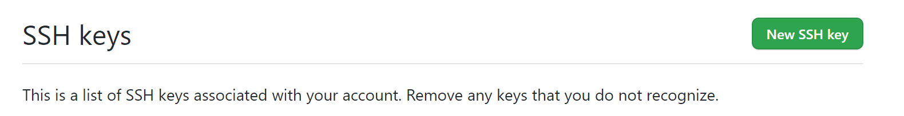
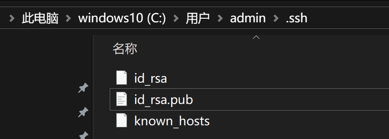
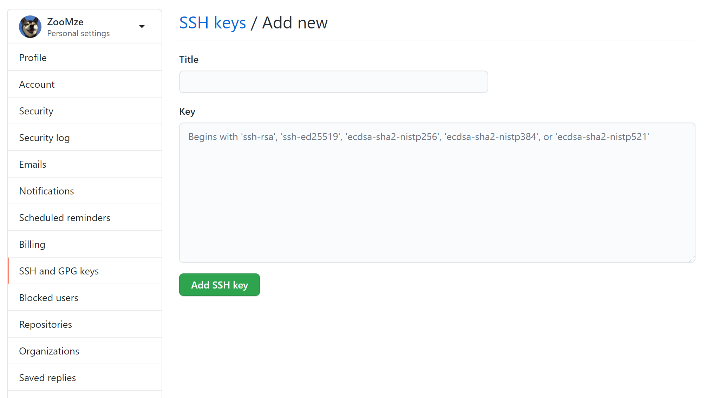

## 前言
为什么GitHub需要SSH Key呢？

因为GitHub需要识别出你推送的提交确实是你推送的，而不是别人冒充的，而Git支持SSH协议，所以，GitHub只要知道了你的公钥，就可以确认只有你自己才能推送。

当然，GitHub允许你添加多个Key。假定你有若干电脑，你一会儿在公司提交，一会儿在家里提交，只要把每台电脑的Key都添加到GitHub，就可以在每台电脑上往GitHub推送了。

那么开始配置SSH吧~

## 1.检查是否存在SSH

首先检查有没有在GitHub的 [https://github.com/settings/keys](https://github.com/settings/keys) 上添加你本机的SSH key。

在用户主目录下，看看有没有.ssh目录，如果有，再看看这个目录下有没有id_rsa和id_rsa.pub这两个文件，如果已经有了，可直接跳
。

如果没有, 则开始第2步, 创建SSH Key

## 2.创建 SSH Key
打开Shell（Windows下打开Git Bash），运行以下命令

`$ ssh-keygen -t rsa -C "youremail@example.com"`

你需要把邮件地址换成你自己的邮件地址，然后一路回车，使用默认值即可。

执行完毕后, 在提示的目录或者本文开头图片中的地址找到相应的的文件 id_rsa 和 id_rsa.puh (这个就是公钥, 下一步我们将使用它)

## 3.配置 SSH Key

进入GitHub的个人设置页, 进入 SSH and GPG keys 选项卡

点击右侧的 **New SSH key** 添加按钮, 将id_rsa.pub 内的内容粘贴进输入框点击保存即可

## 其他问题

如果添加了还是出现这个问题，那么问题大概率就定位在了你本机的这个git仓库并没有和这个SSH key 关联上。用下述方法解决：
ssh-add "你的 id-rsa 文件地址"
注意这里ssh-add后面填的是私钥地址，如mac电脑是 /Users/用户名/.ssh/id_rsa

add之后可以用

`$ ssh git@github.com`

验证是不是添加成功。

参考文档: [https://blog.csdn.net/dotphoenix/article/details/100130424](https://blog.csdn.net/dotphoenix/article/details/100130424)