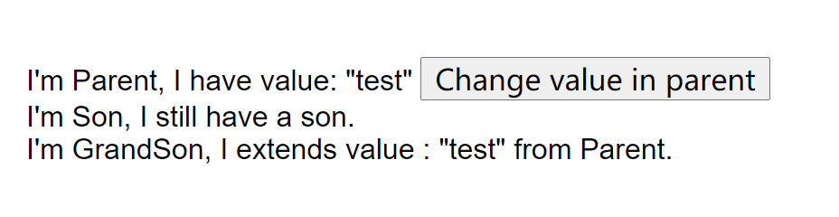
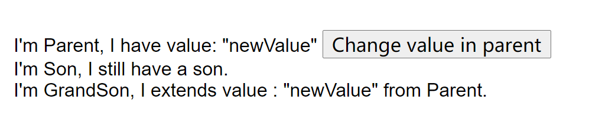

聚沙成塔, 水滴石穿
<!-- more -->

## var / let / const 的区别

* var 会变量提升 let 和 const 不会
* var 在全局命名的变量会挂载到 window 上，let const 不会
* let 和 const 有块级作用域（暂时性死去），var 没有
* let const 不允许重复命名

## computed / filters 的异同

* 对于单个入值的计算, 使用 computed
* 对于多个入值的计算, 使用 filter (得益于filter携带参数写法更加方便)
* 两者在入值 **变化** 时都会触发更新
* 两者都不应承载较多的计算或者逻辑内容, 如果有需求, 使用 `watch`

::: tip 注意

* 上面提到的三种 '计算' 方式, 要避免重复写逻辑, 即不要多处计算方法内写相同的计算逻辑
* 使用 `watch` 时要避免同时修改被监听的数据导致再次触发 `watch`
:::

### 立即执行的 watch

我们知道, `watch` 内的回调只在值变化时触发, 在初始化时是不会触发的, 例如 `watch` 分页的值 `page`, 初始 `page == 1`, 但是我们仍期望执行一次查询, 通常会把这个第一次查询写在 `created` 或是 `mounted` 里。

直接使用 `immediate` 属性即可快速实现这一需求 同时减少不必要的代码和理解成本:

```js {6}
watch: {
  'page': {
    handler(newV) {
      this.fetchData()
    },
    immediate: true
  }
}
```

::: tip 更多
`watch` 的对象中还有一个属性: `deep`, 他可以深度监听内部更深的属性
:::

## 动态组件 components

在v-for循环中条件输出不同的组件, 可以通过 `is` 属性快速直观的实现;
这种方式更适合参数相同或者无参的组件。

```js
import Component1 from '@/components/Component1.vue'
import Component2 from '@/components/Component2.vue'
import Component3 from '@/components/Component3.vue'

export default {
  ...
  components: {
      Component1,
      Component2,
      Component3,
  },
  data() {
    return {
      componentList: [
        'Component1',
        'Component2',
        'Component3',
      ]
    }
  }
}
```

使用组件:

```js
// in template
<component v-for="(item, index) in componentList" :key="index" :is="item"></component>
```

编译结果:

```jsx
<Component1></Component1>
<Component2></Component2>
<Component3></Component3>
```

## 尽量不使用 v-for + v-if

`v-for` 的优先级比 `v-if` 高, 两者嵌套使用时, `v-for` 已经将全部数据遍历过了, 即使运行结果看起来被 `v-if` 过滤掉像是没有执行一样。

在数据量小的时候这样写是可以接受的, 如果数据过多, 应该在js处理完成数据之后在进行 `v-for`, 因为 `render` 遍历消耗的资源可比在js中遍历消耗得多。

## $on() 在任意位置的监听

通常Vue内部是自给自足脱离window这一对象的, 但是也会有特殊情况, 例如: 检测浏览器的宽高, 从而调整内部组件的位置大小等。

常规思路是直接在Vue的生命周期内部关联事件监听器, 再使用 `methods` 里面的方法回调事件, 像这样:

```js
mounted () {
  window.addEventListener('resize', this.resizeHandler);
},
beforeDestroy () {
  window.removeEventListener('resize', this.resizeHandler);
}
```

但是每次都这样写, 为了避免事件重叠还必须要在当前组件销毁前将事件也 **注销** 掉, 这样代码分离过远导致修改时漏掉, 易读性大大降低, 于是我们用API `$on()` 来改写一下上面的代码:

```js {4-6}
mounted () {
  window.addEventListener('resize', this.resizeHandler);
  // 注册和注销的代码 写在一起, 使得代码可读性大大提高
  this.$on("hook:beforeDestroy", () => {
    window.removeEventListener('resize', this.resizeHandler);
  })
}
```

## v-pre 和 v-once

这两个指令都能有助于提高渲染效率:

* `v-pre` 会跳过**编译过程**, 直接输出当前内容

```js
<el-button v-pre>{{ page }}</el-button> // >> 直接输出 '{{ page }}' 而不是页码
```

* `v-once` 只渲染一次, 适用于渲染不再修改的静态内容, 合理使用可以节省很多性能损耗

::: warning 警告
使用 `v-pre` 时, 注意不要添加事件绑定等特殊属性, 否则会导致编译错误; 同时 `v-pre` 应该尽量用于原生DOM标签上。
:::

## $set 触发数组更新

先来看看在下面的代码中, 假设一下每行代码分, 那些操作会触发视图更新?

```javascript
<template>
  <div>
    <div v-for="item in listData" :key="item.id">{{ item.name }}</div>
    <el-button @click="handleClick1">修改1</el-button>
    <el-button @click="handleClick2">修改2</el-button>
    <el-button @click="handleClick3">修改3</el-button>
  </div>
</template>

<script>
  data() {
    listData: [{ name: 'a', id: '1' }, { name: 'b', id: '2' }, { name: 'c', id: '3' }]
  }
  // 以下方法每次分开执行, 每一个执行完后刷新, 没有先后关系
  handleClick1() {
    this.listData[2].name = 'd'
  },
  handleClick2() {
    this.listData[2] = { name: 'd', id: '4' }
  },
  handleClick3() {
    this.listData.length = 2
  }
</script>
```

::: details 查看结果

```js
handleClick1()
// 视图和listData同步更新为 >> [{ name: 'a', id: '1' }, { name: 'b', id: '2' }, { name: 'd', id: '3' }]

handleClick2()
// 视图不刷新 listData已变为: [{ name: 'a', id: '1' }, { name: 'b', id: '2' }, { name: 'd', id: '4' }]

handleClick3()
// 视图不刷新 listData已变为: [{ name: 'a', id: '1' }, { name: 'b', id: '2' }]
```

:::

结论: 由于`Object.defineprototype()`的限制, 当 _通过索引修改多维数组项_ 或者 _直接修改数组长度时_, 数据不会更新视图, 要想更新视图,  使用API `$set`:

```js
this.$set(listData, 2, { name: 'd', id: '4' });
```

* 更详细的内容查看官方文档: [全局API:  $set](https://cn.vuejs.org/v2/api/#Vue-set)

## Virtual DOM

Virtual DOM 简单的说就是一颗树，一颗以javaScript对象（VNode）作为基础的树，用对象的属性来描述节点，因此这个对象至少包含标签名（tag）、属性（attrs）、和 子元素对象（chuildren）

Virtual DOM 的最终目的是将虚拟的节点渲染到视图上，其实它主要做了两件事：(1)、提供与真实DOM节点对应的虚拟节点VNode；(2)、将虚拟节点VNode和旧虚拟节点(oldVNode)进行对比，然后更新视图；

### 优势

1. 具备跨平台的优势
2. 操作DOM慢，js运行的效率高；vue 将 DOM 对比放在js层，提高效率，Virtual DOM 本质上其实就是 js 和 dom 之间的一个缓存，通过 `patching` 算法计算出真正需要更新的节点，最大限度的减少DOM操作
3. 提升渲染的性能；dom操作的减少，可以避免更多的回流和重绘等，更加高效的提高性能

## VNode

我们已经知道 Vue 和 虚拟DOM 关系深远, 同时 虚拟DOM 树上会有诸多节点 (Node), 他们可以通过 `createElement` 创建并返回, 这样的节点就被称为 '虚拟节点'(Virtual Node), 简称 **VNode**

::: tip `createElement`
官方文档中描述 `createElement` 准确的名称应该是 'createElementDescription', 因为它并未真正的返回一个元素, 只返回了一个元素的描述信息
:::

### createElement

createElement只能在 `render` 函数中或者是通过 `vm.$createElement()` 来调用!

了解了这个函数所返回的内容, 下面就需要使用它来构造VNode, 说到构造肯定就要依赖参数啦, 我们来看看它接受些什么参数

参数顺序|参数类型|描述|举例
:-|:-|:-|:-
1|{ String / Object / Function }|标签名/组件选项对象/或者resolve了前两者的async函数| 'div'
2|{ Object }|与模板中attribute所对应的数据对象|这个示例下一节将详细描述
3|{ String / Array}|子级VNode, 同样需要 createElement 生成| [ ... ]

是的, 你可能发现了, 第一个参数可以直接传入组件, 当传入组件时, 要么**预留插槽**, 要么 **指定插槽**!

```js
// template是个预留了插槽的组件
...
this.$createElement(
  {
    template: `
      <div>
        <p>我下方有个插槽, 我还有自己的数据: {{ someData }}</p>
        <slot><slot>
      </div>
    `,
    data() {
      return {
        someData: 'xxx'
      }
    }
  },
  // 这里忽略了第二个参数
  [
    '这个是文本节点',
    this.$createElement('p', '这个是p节点')
  ]
)
```

实际使用中, 可以忽略第二个参数, 只写标签和子节点一样能被正确识别, 这是因为 vue 是根据参数类型进行识别的, 因为第二三个参数类型不可能相同

上述代码是自带插槽的情况, 那如果没有在template内指定插槽呢? 这时候就需要访问 `this.$slots.default`

TODO...

无论哪种写法, 上面的例子最终渲染成这样:

```html
<div>
  <p>我下方有个插槽, 我还有自己的数据: xxx</p>
  "这个是文本节点"
  <p>这个是p节点</p>
</div>
```

## vuex

vuex 是 vue.js 中的状态管理, 它的出现是为了解决在多个组件之间复用和修改**同一属性**困难的问题

### 辅助函数

本小节通过介绍辅助函数来巩固加深 vuex中的相关知识和内容

vuex中提供了若干辅助函数, 通过扩展组件内原有的内容(即 对象混合), 例如 `computed` / `methods`, 使用我们可以更方便的调用vuex中的所有内容

我们先在store中简单定义一些基本内容, 方便后面的代码演示:

```js
// store.js
...
state: {
  name: 'a',
  name2: 'aa'
},
getters: {
  getName: state => {
    return state.name
  },
  getNewName: (state) => (idNumber) => { // 这里可以让getter带参调用
    return `${state.name} ${idNumber}`
  }
},
mutations: { // 这里命名的方式是参考了vuex的官网, 也可以不这样命名
  CHANGE_NAME: state => {
    state.name = 'b'
  },
  CHANGE_LAST_NAME: (state, params) => {
    state.name = state.name + params
  }
},
actions: {
  changeName(state) {
    state.commit('CHANGE_NAME')
  },
  ChangeLastName({ commit }, payload) {
    commit('CHANGE_LAST_NAME')
  },
}
...
```

#### mapState

快速获取状态 `state` 的值, 不用再重复的写 `this.$store.state.name`, 并且可以将state的变量再取一个新的变量名

```js
...
data() {
  return {
    localName: '666'
  }
},
computed: {
  ...mapState(['name','name2']) // 这里不能随便改名字
  // 像下方这样写也是OK的
  // ...mapState({
  //   newName: 'name',
  //   newName2: (state) => state.name2,
  //   mixName(state) { // 为了能够使用 this 获取局部状态，必须使用常规函数
  //     return `${state.name} ${this.localName}`
  //   }
  // })
}
...
// 在组件内随时调用
this.name    // >> 'a'
this.newName // >> 'a'
this.mixName // >> 'a 666'
```

#### mapGetters

快速获取 `getter`, `getter` 用于对 `state` 的状态进行派生和逻辑处理等, 它存在的意思有点类似于组件里的计算属性 `computed` 一样

```js
import { mapGetters } from 'vuex'
...
computed:{
  ...mapGetters(['name','name2']) // 这里不能随便改名字
  // 像下方这样重新取名也是可以的
  // ...mapGetters({
  //   getName: 'getName',
  //   getNewName: 'getAllName'
  // })
}
...
// 在组件内随时调用
this.getName         // >> 'a'
this.getNewName(777) // >> 'a 777'
```

#### mapMutation

`mutation` 的用处是来改变 `state` 内的值, 并且在vuex中只能通过这一种方式进行显示提交, `mapMutation` 是用来提供映射来简化代码, 即不需要再写一堆 `this.$store.commit()`, 就像是组件内自带的函数一样调用

\* **mapMutation 是扩展了methods对象**

```js
import { mapMutations } from 'vuex'

export default {
  // ...
  methods: {
    ...mapMutations([
      // `mapMutations` 支持载荷(payload)：
      'CHANGE_LAST_NAME' // 将 `this.CHANGE_LAST_NAME(amount)` 映射为 `this.$store.commit('CHANGE_LAST_NAME', amount)`
    ]),
    // 也可以改名字
    // ...mapMutations({
    //   changeLastName: 'CHANGE_LAST_NAME'
    // })
  }
}

// 在组件中调用
this['CHANGE_LAST_NAME']('mutation') // >> 'a 后缀词'
this.changeLastName()                // >> 'a'
```

#### mapActions

当一个组件内多次重复调用 `this.$store.dispatch()` 来提交action时, 同样可以使用类似上面的 `mapActions` 来达到映射简化的目的

```js
import { mapGetters } from 'vuex'
...
computed:{
  ...mapActions({
    // 同样支持载荷
    change: 'changeLastName'
  })
}
...
// 在组件内调用
this.change('action') // 相当于调用了 this.$store.dispatch('changeLastName', 'c') >> 'a action'
```

### Modules

当状态过多时, 全部揉在一个store里就会变得臃肿和难以维护, 这时就要进行拆分成 `modules`, 每一个 `module` 都可以拥有自己的 `state`, `getters`, `mutations`, `actions`

::: warning 注意
这些 `modules` 里的所有状态内容, 会被合并到全局状态里面去, 所以可以通过添加 `namespaced: true` 将其变为带命名空间的模块, 已达到更高的封装性

```js
// a module named user.js
export default {
  namespaced: true, // 开启后, 所有内容会加上本module的名字作为前缀
  state,
  getters: {
    getUser: (state) => {
      return state.userName + '666'
    }
  }
  mutations,
  actions
}
```

这样一来, 当你在外部需要访问 user 这个 module 中的 `getUser()` 时, 其名称会变为 `'user/getUser'`, 例如

```js
// in another component
...
computed: {
  ...mapGetters({ getUser: 'user/getUser' }) // 这里又是重命名的方式引入的
},
...
```

:::

## Provide & Inject

刚刚讲完vuex, 新的问题又出来了, 多层组件之间传递同一个值一直是令人头疼的问题, 而且通常 **最内层** 组件内要期望可以访问到 **最外层** 向下流动的数据, 按照以往的模式, 要么直接一层一层的用props来传, 要么借用老大哥vuex, 这两个明显都不是最好的解决方案: 一个代码不够优雅一个无法完全组件化还得依赖vuex, 下面就介绍最佳解决方案: Provide & Inject。

先定义一个父组件 `Parent.vue`:

```html
<template>
  <div>
    I'm Parent, I have value:  {{ testValue }}
    <button @click="changeTest">Change value in parent</button>
    <son /> <!-- 注意这里没有传参 -->
  </div>
</template>

<script>
  import Son from './Son'
  export default {
    name: 'parent',
    components: { Son },
    provide() {
      return {
        injectValue: this.testValue // 在provide里定义名称
      }
    },
    data() {
      return {
        testValue: 'test'
      }
    },
    methods: {
      changeTest() {
        this.testValue = 'newValue'
      }
    }
  }
</script>
```

然后再来个子组件 `Son.vue`, 这里同样没有接收任何参数, 也不向下传递任何参数, 仅作为一个中间层

```html
<template>
  <div>
    I'm Son, I still have a son.
    <grand-son />
  </div>
</template>

<script>
import grandSon from './GrandSon'
export default {
  name: 'Son',
  components: { grandSon },
  data() {
    return {
      title: 'Son'
    }
  }
}
</script>
```

最后再来个孙组件 `GrandSon.vue`, 在没有直接参数流动的情况下孙组件直接获取 `Parent` 组件所提供的值

```html
<template>
  <div>
    I'm GrandSon, I extends value : {{ value }} from Parent.
  </div>
</template>

<script>
  export default {
    name: 'GrandSon',
    inject: ['injectValue'], // 在inject内接收
    mounted() {
      console.log(this.injectValue)
    }
  }
</script>
```

页面结果如下:



但是我们如果点击一下change按钮, 会发现值在孙组件中并不会更新, 这一点vue也明确说明了

::: tip 非响应式
`provide` 和 `inject` 绑定并不是可响应的。这是刻意为之的。然而，如果你传入了一个可监听的对象，那么其对象的 `property` 还是可响应的。
:::

这里挖个坑, 什么是可监听的对象? // TODO

### 响应式解决方案

响应式的存在非常有必要, 通常开发中总是在父组件和子组件要同步更新数据, 既然vue不默认提供, 那我们就想办法让他响应

首先更改父组件 `Parent.vue`

```html
<template>
  <div>
    I'm Parent, I have value:  {{ testValue }}
    <button @click="changeTest">Change value in parent</button>
    <son />
  </div>
</template>

<script>
  import Son from './Son'
  export default {
    name: 'parent',
    components: { Son },
    provide() {
      return {
        injectValue: _ => this.testValue // 这里使用函数返回, 保留引用
      }
    },
    data() {
      return {
        testValue: 'test'
      }
    },
    methods: {
      changeTest() {
        this.testValue = 'newValue'
      }
    }
  }
</script>
```

再来修改 `GrandSon.vue`:

```html
<template>
  <div>
    <!-- 不再直接使用 injectValue 来接收 -->
    I'm {{ title }}, I extends value : "{{ computedInjectValue }}" from Parent.
  </div>
</template>

<script>
  export default {
    name: 'GrandSon',
    inject: ['injectValue'], // 以同样的方式inject内接收, 但是这里的值其实是函数哦
    data() {
      return {
        injectData: null,
        title: 'GrandSon'
      }
    },
    computed: {
      computedInjectValue() { // 用计算属性获取最终的值
        return this.injectValue()
      }
    }
  }
</script>
```



可以发现, 点击后数据是响应的

更多内容查看官方文档: [Vue: provide / inject](https://cn.vuejs.org/v2/api/#provide-inject)

## 自定义指令

vue自身就有很多指令, 什么v-model、v-for、 v-if, 天天用天天见, 本节就介绍一下如何创建一个自定义的指令

自定义指令有两种注册方法:

* 全局注册
* 组件内注册

```js
// 全局注册
// 注册一个 `v-focus` 指令
Vue.directive('focus', {
  // 当被绑定的元素插入到 DOM 中时……
  inserted: function (el) {
    // 聚焦元素
    el.focus()
  }
})
```

```js
// 组件内注册
// 通过directives选项注册
directives: {
  focus: { // 这里是指令的名字
    inserted(el) { // 指令的钩子函数, 下面会详细说明
      el.focus()
    }
  }
}
```

注册完毕后, 则直接在元素上使用, 现在这个input在页面加载完成后将自动聚焦

```js
<input v-focus>
```

### 钩子函数

一个自定义指令对象会提供总共五个钩子函数(它们都是可选的):

* `bind`: 只调用一次, 第一次绑定到元素时调用, 类似于mounted
* `inserted`: 被绑定元素插入父节点时调用
* `update`: 组件更新VNode时调用, 通常情况下需要自行比较`VNode` 和 `OldVNode`
* `componentUpdated`: 在VNode以及子VNode全部更新后调用
* `unbind`: 只调用一次, 指令与解绑时调用, 类似于destroy

#### 钩子函数的参数

每个钩子函数都有同样的参数, 它们分别是:

* `el`
* `binding`
* `vnode`
* `oldVnode`

更全参数的内容在这里 [Vue: 钩子函数的参数](https://cn.vuejs.org/v2/guide/custom-directive.html#%E9%92%A9%E5%AD%90%E5%87%BD%E6%95%B0%E5%8F%82%E6%95%B0)

本篇只提一下这个 `binding` 参数:

主要执行的执行逻辑需要的内容几乎都可以在这里找到

#### 动态指令参数

自定义指令更加实际化的应用模式, 就是传递参数, 它的基本语法是这样的

`v-directive:[arg]="value"`

参数有两种方式进行传递:

* 通过 `arg` 进行传递, 它会出现在`binding.arg`
* 通过 `value` 传递, 它会出现在 `binding.value`

## 动画与过渡

当界面拥有更加流畅的动画时, 交互体验将会大大提升
